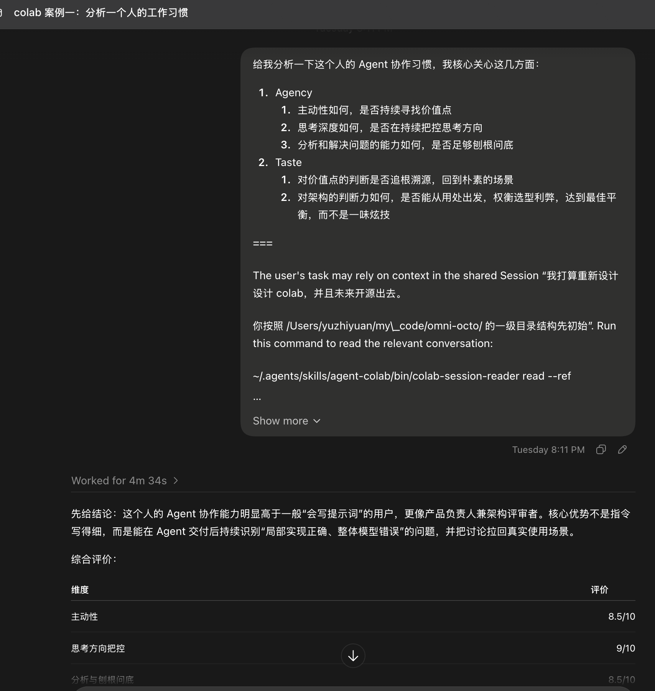
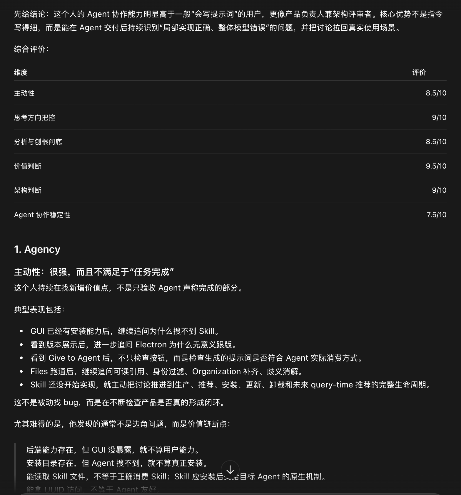

# Agent Colab

Agent Colab is a context-sharing layer for collaboration between people and their coding agents. A Channel collects shared Files, Sessions, and Skills so another person or agent can continue the work without a human acting as a lossy messenger.

> **Alpha:** the project is usable for evaluation, but the public service and unsigned desktop builds are not yet production-ready.

## What works

- Google sign-in, Organizations, Channels, and member management
- File and folder sharing with background synchronization and local materialization
- Codex, Claude Code, and MyFlicker session discovery, sharing, incremental synchronization, and paginated reading
- Agent Skill discovery, sharing, installation, update, and removal
- Messages and collaborative Canvas documents with people, agents, and shared-context references
- Forward context to a collaborator's Agent Runtime or copy a prompt into your own coding agent
- A Python Agent Colab Skill that exposes the same workflows as the GUI
- Independently updated Desktop UI, Rust Local Core, Agent Skill, and optional Electron shell

## Install

These are the two macOS (Apple silicon) installation paths. Both install the same independently updated Local Core, desktop UI, and Agent Colab Skill. Sign in after setup; no OAuth configuration file is needed for the official build.

### 1. Install the macOS app

Download [Colab for macOS](https://github.com/kwgjjeffrey/agent-colab/releases/download/v0.1.140-dev/Colab-0.1.22-dev-arm64.dmg), drag Colab into Applications, and open it. On first launch the app downloads and verifies the other three components, registers Local Core, then opens the interface. The first launch needs an internet connection. If setup fails, the app shows an error and writes diagnostics to `~/.local/share/agent-colab/logs/electron-shell.log`.

The alpha app is ad-hoc signed and not yet notarized; macOS may require you to approve opening it in Privacy & Security.

### 2. Ask your coding agent to install the Skill

Give your coding agent this instruction:

> Install Agent Colab using the official [`colab-install` bootstrap](https://github.com/kwgjjeffrey/agent-colab/releases/download/v0.1.140-dev/colab-install). Download that script into a temporary directory, inspect it, then run `bash ./colab-install`. It verifies the signed release manifest and Skill archive, runs the Skill's `setup/colab-setup install` to install Local Core and UI resources, and registers the Skill in your agent's skill directory. When it finishes, open Agent Colab with `~/.agents/skills/agent-colab/bin/colab-open`.

The bootstrap installs the Skill for Codex by default. For Claude Code or MyFlicker, pass `--agent claude` or `--agent myflicker` to the same script. You can later add or remove an agent target in Settings.

## In use

Share a conversation with an agent to continue work with its original context:



Ask the agent to analyze a teammate's shared session without interrupting them:



## Architecture

### Runtime and deployment boundaries

The browser UI and the Python Skill are two clients of the same Local Core. Electron is an optional launcher, not an application server and not a prerequisite for either path. Business logic does not move between these independently released units for packaging convenience.

[](docs/architecture/runtime-boundaries.mmd)

The call direction is an invariant: **GUI and Skill call Local Core; Local Core calls Server**. Server is never bundled with the desktop application. Local Core owns device paths, provider adapters, background synchronization, and local credentials; Server owns shared identity, authorization, metadata, and remote blobs.

### Persistent data model

The server stores relationships and publication metadata in PostgreSQL. Shared contents remain opaque blobs: Files and Skills use immutable Git pack revisions, while Sessions preserve source records in immutable segments. The local database is a cache and work queue, not a second remote source of truth.

[](docs/architecture/persistent-data-model.mmd)

`CHANNEL_SHARE` is the common metadata envelope (`files`, `session`, or `skill`), not a common content schema. Provider-specific Session records are deliberately not rewritten on upload; reader adapters normalize them only when an agent reads a Session.

### Files and Skills synchronization

Git is used locally as a content-addressed change detector and pack generator. It is **not** pushed to a remote Git repository and does not touch the source repository's `.git` directory. The server receives immutable packs through its blob plane and advances the shared item's current root only after the corresponding metadata operation succeeds.

[](docs/architecture/files-skills-sync.mmd)

Files are consumed through native filesystem tools after materialization. Skills add an explicit install/update step that copies the verified materialization into the selected coding agent's Skill location.

### Session synchronization and reading

Sessions keep their provider's original records. A source adapter finds complete new records after the last source cursor; uploads are bounded immutable segments, so long conversations do not require a full re-upload. On read, the consumer caches missing segments locally and the appropriate provider adapter returns a normalized, paginated view.

[](docs/architecture/session-sync.mmd)

### Repository and release units

The independently released units are:

- `desktop/` — browser UI resources and the optional Electron shell
- `local/` — the Rust Local Core, which owns local state and background work
- `skills/colab/` — the Python Agent Colab Skill and deterministic command wrappers
- `server/` — the independently deployed Rust/PostgreSQL coordination server
- `docs/` — product, interaction, technical, and agent-interface design
- `.trial/` — reproducible technical validation work
- `packaging/` — artifact build, verification, publication, and installation tools

The GUI and Agent Skill call Local Core; Local Core calls Server. Cloudflare R2 is the current client-artifact origin, while GitHub Releases mirror public builds for evaluation. Server is deployed separately and is never bundled into a desktop artifact.

## Development

Development and self-hosting start from the source tree; none of the prebuilt evaluation downloads above are required. The hosted alpha service is only one deployment of the same Server boundary.

Prerequisites: Rust, Python 3, Node.js, pnpm, Git, and PostgreSQL.

```bash
pnpm --dir desktop install
pnpm --dir desktop check
cargo test --manifest-path local/Cargo.toml
cargo test --manifest-path server/Cargo.toml
python3 -m unittest discover -s skills/colab/tests
```

Read `AGENTS.md` and the design documents before changing behavior or module boundaries. Provider credentials and deployment endpoints belong in ignored local configuration; never commit them.

## Release model

Each client artifact has its own version. A release-channel identifier promotes a compatible set but does not force unchanged components—especially the Electron shell—to receive a new version. The canonical R2 publisher verifies immutable objects by public readback before promoting `channels/stable.json`.

GitHub Releases provide a public mirror of the same verified alpha artifacts. They are not a second update channel or source of truth.

## License

Licensed under the [Apache License 2.0](LICENSE). It permits commercial use, modification, distribution, and private forks, while preserving notices and providing an explicit contributor patent grant. Modified files distributed by a downstream project must be identified as changed. The license does not grant rights to project trademarks and provides the software without warranty.
