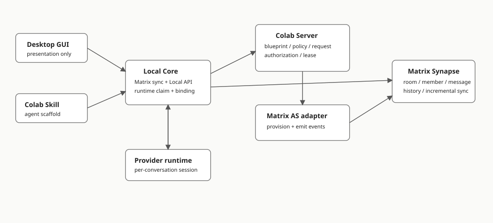
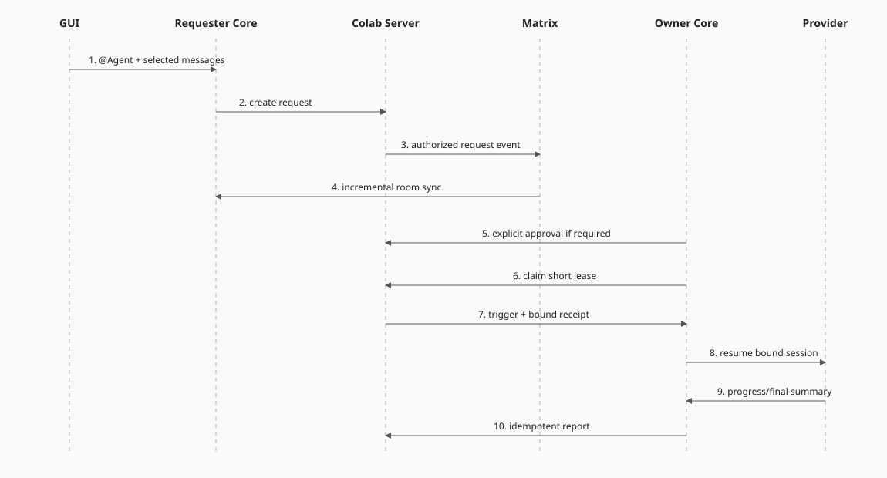

# Conversation / DM product and technical design

Status: first implementation approved; in progress.

## Final IM ownership decision

Colab owns its IM domain and uses authenticated WebSocket only as the realtime transport. Messages,
rooms, membership, ordering, pagination, reconnect cursors, replies, receipts and Agent Request state
belong to Colab Server and PostgreSQL. WebSocket is never a second source of truth.

This decision follows an explicit investigation:

- Matrix is an open protocol; Synapse and Tuwunel are homeserver implementations. Tuwunel is fully
  source-open under Apache-2.0, but its supported product boundary is a standalone homeserver rather
  than a stable embeddable Rust IM library. It still adds Matrix identities, rooms, sync state and
  an independently persisted service domain.
- OpenIM and Tinode expose broad IM capabilities, but each brings its own server, identity/group
  model, persistence and client protocol. OpenIM additionally brings a multi-service dependency
  stack; Tinode's server license and Go runtime are also a poor fit here.
- Centrifugo, Mercure, MQTT and similar systems solve connection, fan-out or recovery layers rather
  than the IM business domain. They do not remove message, room, membership and authorization work.
- WeChat, QQ and Facebook Messenger publicly describe internally owned IM domains built on mature
  transports and storage primitives rather than a third-party complete IM framework. Their scale
  does not justify copying their infrastructure, but confirms the boundary between reliable
  primitives and product-domain ownership.

Do not reopen this comparison merely because another IM server or realtime gateway is discovered.
Reconsider an external protocol only after a committed requirement for federation, third-party
clients, interoperable end-to-end encryption, or an independently operated public IM network.

## Product interaction

The concrete low-fidelity layout is in [conversation-wireframe.html](../.trial/interaction-wireframe/conversation-wireframe.html). It extends the existing Channel rail instead of inventing a separate shell. The Conversation and Agent-blueprint editor are mutually exclusive application screens in that wireframe; the editor is not a layer underneath or on top of the message composer.

- Conversations is a fixed application-level entry above the Channel icons.
- The main surface has a conversation list, message pane, and participant/reference pane.
- Agent blueprints are account settings: name, avatar, purpose, provider, invocation policy, and preferred runtime.
- Configure with my coding agent produces a target-specific prompt containing the dedicated blueprint scaffold. The primary action uses the default coding agent; other installed agents live in the adjacent menu.
- Add people or agents searches Organization people and available blueprints together. A row always shows blueprint owner, provider, runtime status, and invocation policy.
- Hover/focus exposes message selection. One or more messages can be forwarded to a person or passed as explicit input to a participating agent.
- Agent output is an ordinary message, optionally replying to the triggering message and showing source chips for referenced Shared Items. Internal runtime delivery state is not rendered as a Conversation card.
- Conversation may reference Channel context, but neither membership nor authorization is inherited in either direction.

## IM foundation decision

The first implementation should **not deploy a general IM server or a separate realtime gateway**. The existing Axum-based Colab Server owns the deliberately small message domain in PostgreSQL. It exposes a Conversation WebSocket for sequence invalidations and a logically separate runtime WebSocket for commands addressed to one authenticated runtime. They may share Axum and a network listener, but not envelopes, recovery cursors or business state.

Conversation writes still travel Local Core → Server over HTTPS. A Conversation notification may be duplicated or lost because PostgreSQL `conversation_messages.seq` is authoritative: connect, reconnect, stream lag, and explicit refresh all run the same `after=<seq>` reconciliation. Runtime commands instead remain durable on Server and are pushed over the runtime socket, acknowledged by Local Core, and replayed after reconnect when unacknowledged. Neither protocol requires periodic HTTP polling.

Decision criteria, in order:

1. Minimize total implementation and operational work for the accepted first slice, not for a hypothetical general messenger.
2. Preserve the implemented Organization/Member authorization model as one source of truth.
3. Make durable writes, pagination and reconnect correctness explicit and testable.
4. Use the smallest established transport implementation that meets the actual one-way requirement; do not build a custom wire protocol.
5. Keep a credible path to richer IM only if product evidence later requires it.

### What the first slice actually needs

It needs DM/group membership, append-only text messages, pagination, one reply/quote link, mentions, forwarding selected messages, and Agent Request status/result messages. It explicitly does **not** need federation, end-to-end encryption, reactions, typing, read receipts, media, mobile push, arbitrary Matrix clients, or years of protocol interoperability.

The new domain tables required regardless of transport are `conversations`, `conversation_members`, `agent_blueprints`, `conversation_agents`, `agent_runtimes`, `agent_requests`, leases and context references. The bounded durable work is therefore much smaller than "build an IM system":

- `conversation_messages`: append-only message body, sender actor, per-Conversation monotonic `seq`, idempotent `client_nonce`, optional `reply_to_message_id`, and redaction state;
- `GET messages?after=<seq>` and reverse pagination before a cursor;
- one authenticated Conversation WebSocket and one runtime-authenticated command WebSocket in the existing Axum Server;
- client reconciliation: coalesce invalidations and fetch from PostgreSQL after the last applied `seq`; reconnect always runs the same catch-up query. Server emits a 15-second text heartbeat and the GUI recycles a nominally-open connection after 45 seconds without any frame, because half-open browser sockets do not reliably emit `close` after proxy/NAT or sleep failures.

Conversation writes go through Colab Server HTTPS, and WebSocket never carries authoritative message history. The runtime WebSocket carries complete commands only after Server has committed and authorized them; it is delivery transport, while PostgreSQL remains recovery truth.

### Alternatives evaluated against this product

The alternatives are not limited to Matrix, XMPP, Centrifugo, and raw WebSocket. They occupy different layers and must not be compared as if they were interchangeable IM products.

| Candidate | What it supplies | Extra runtime | Recovery source | Fit for the first slice | Decision |
| --- | --- | --- | --- | --- | --- |
| **Axum WebSocket + in-process fan-out** | Authenticated bidirectional notification/control connection, Ping/Pong and close semantics | None; code lives in existing Server | Conversation uses PostgreSQL `seq` pull; runtime commands use PostgreSQL claims plus request-scoped ACK | Small resource delta versus SSE and supports distinct Conversation and Agent-runtime protocols without another service | **Selected.** Conversation frames are repairable invalidations; runtime frames contain complete commands and protocol 2 ACK, with PostgreSQL authoritative for both. |
| **Axum WebSocket + PostgreSQL `LISTEN/NOTIFY`** | Same client edge plus cross-process invalidation between Server replicas | No new product, but one dedicated DB listener per replica | Same PostgreSQL `seq` pull | Useful only after more than one Server instance can accept writes/connections | **Scale-out step 1**, not alpha dependency. `NOTIFY` carries IDs only and fires after commit. |
| **Centrifugo** | Connection gateway, channel fan-out, recovery/history options, SDK ecosystem | Separate service; Redis when scaled horizontally | Can still be Colab PostgreSQL | Proven once connection/fan-out operations become material; redundant for one Server and one-way invalidation | **Scale-out step 2** behind the same invalidation contract if measured load or operations justify it. |
| **Mercure** | Standards-oriented SSE hub, topic authorization and replay facilities | Separate hub and configuration | Hub plus application DB depending on configuration | Direction fits, but adds a service while Colab already owns auth and durable cursors | Reconsider alongside Centrifugo only when a gateway is needed. |
| **Redis Pub/Sub or NATS Core** | Cross-process ephemeral broker | Separate broker; still requires the WebSocket edge | None in their basic mode | Solves Server-to-Server fan-out, not Local-Core connectivity; duplicates what PostgreSQL can initially signal | Reject initially; add only when topology or throughput outgrows Postgres notifications. |
| **Redis Streams, NATS JetStream, Kafka/RabbitMQ** | Durable broker, replay and consumer state | Durable broker cluster and operations | Broker cursor | Duplicates PostgreSQL message durability and cursor for current volume | Reject until independent event consumers need separate retention/retry. |
| **SSE** | One-way server event stream over HTTP | None | Must still use PostgreSQL cursor | Sufficient for current invalidations, but gives no transport path for likely Agent cancel/pause/presence controls | Valid simpler alternative, not selected after assigning weight to near-term Agent control. |
| **Matrix / XMPP** | Complete messaging protocol/server ecosystem | Separate IM service and persistent state | IM service | Valuable for federation, E2EE, third-party clients or broad messenger semantics; these are excluded | Reject now; reopen only when those requirements are committed. |
| **Managed Ably/Pusher/Stream-style APIs** | Hosted connection edge and often message features | External SaaS dependency | Provider-specific | Low initial operations but conflicts with self-hosting, open-source substitution, and provider-neutral deployment | Reject as the default architecture. |

The selected implementation is Axum WebSocket plus the Colab-owned domain described above. It is
not presented as an IM framework: correctness comes from explicit PostgreSQL invariants, cursor
reconciliation and black-box tests, while Axum supplies only the established transport primitive.

Concrete promotion triggers:

1. Add PostgreSQL `LISTEN/NOTIFY` when Colab Server is deployed with multiple replicas. It is an inter-replica wake-up, not a durable queue and not a client protocol.
2. Trial Centrifugo and Mercure when persistent connection count, slow-consumer isolation, regional routing, or operational metrics show the Server should no longer own the connection edge.
3. Add a durable broker only when independent asynchronous consumers have retry/retention requirements beyond PostgreSQL message cursors.
4. Reopen Matrix/XMPP only when the product scope itself changes to complete IM interoperability or security semantics.

### Public production evidence

Public adoption is evidence of operational maturity, not a substitute for matching Colab's domain boundary. The relevant examples are:

| Candidate | Public examples | What the example actually proves | What it does not prove |
| --- | --- | --- | --- |
| Axum WebSocket | Axum exposes WebSocket upgrade, message, Ping/Pong and close primitives over its existing HTTP stack. This is library capability rather than a named-product adoption case. | The existing Server framework can host the persistent connection without another service; WebSocket leaves room for narrowly defined bidirectional Agent controls. | It supplies a transport, not an IM domain, recovery cursor, membership or durable messaging. |
| Matrix | France's public-sector Tchap organization publishes its Matrix clients and SDK forks; Germany's Matrix-based BwMessenger reports more than 100,000 active users. Matrix's conference report also names Gematik, Swiss Post, SAFOS, Tele2 and NATO NI²CE deployments. | Matrix is demonstrably suitable for complete, sovereign, multi-client messaging deployments. | These deployments value federation, sovereignty, security and complete messenger behavior. They do not prove that Synapse is the lowest-cost backend for Colab's narrow first slice. |
| XMPP / Prosody | Jitsi Meet uses XMPP as its signalling hub; its official Docker stack runs Prosody as the XMPP server. The XMPP Standards Foundation also lists Zoom, Jitsi and multiple games/services as XMPP-backed products, often with proprietary extensions. | XMPP and Prosody are mature enough for high-volume, stateful realtime collaboration, and the standards ecosystem is genuinely deployed. | Jitsi primarily validates signalling/MUC. It does not show that assembling the exact MAM, multi-device, reply and web-client profile needed by Colab is cheaper than Matrix. Some XSF product counts describe modified XMPP rather than interoperable vanilla deployments. |
| Centrifugo / Centrifuge | Grafana's repository directly imports `github.com/centrifugal/centrifuge` for Grafana Live, which its product documentation describes as its realtime WebSocket/PubSub engine. The Centrifuge maintainer reports an adapted engine serving about 800,000 active connections in Avito's messenger. Centrifugo also self-reports production use by VK, Badoo, ManyChat and OpenWeb. | The exact layer we intend to delegate—persistent connections, fan-out and short reconnect recovery—has large production use, including a messenger transport. | Grafana is not chat. The Avito number is a maintainer report rather than an independent case study, and the named-company list does not disclose each architecture. None of these cases means Centrifugo owns durable messages or membership. |
| Raw WebSocket | Nearly every web IM ultimately uses a persistent transport, but that is not a reusable IM implementation. | The browser transport is ubiquitous. | It supplies no membership, durable history, pagination, reply relations, idempotency or reconnect cursor contract. |

The evidence shows that the larger alternatives are mature, but maturity is not the deciding criterion. The current product needs one-way wake-up inside an already deployed HTTP server; selecting a separate gateway merely because it has production cases would optimize a scale problem we have not reached.

Primary research:

- [Matrix Client-Server API](https://spec.matrix.org/latest/client-server-api/)
- [Matrix Application Service API](https://spec.matrix.org/latest/application-service-api/)
- [Synapse installation and production PostgreSQL guidance](https://element-hq.github.io/synapse/latest/setup/installation.html)
- [Registering an external Application Service with Synapse](https://element-hq.github.io/synapse/latest/application_services.html)
- [Matrix SDK ecosystem](https://matrix.org/ecosystem/sdks/)
- [XMPP Multi-User Chat](https://xmpp.org/extensions/xep-0045.html)
- [XMPP Message Archive Management](https://xmpp.org/extensions/xep-0313.html)
- [XMPP Stream Management](https://xmpp.org/extensions/xep-0198.html)
- [Centrifugo history and recovery](https://centrifugal.dev/docs/server/history_and_recovery)
- [Centrifugo messenger tutorial with application database as source of truth](https://centrifugal.dev/docs/tutorial/intro)
- [Centrifuge production report including Avito Messenger](https://centrifugal.dev/blog/2021/01/15/centrifuge-intro)
- [Centrifugo client SDK inventory, including the community Rust connector](https://centrifugal.dev/docs/transports/client_sdk)
- [Tchap deployment scale, Matrix Conference 2025](https://2025.matrix.org/slides/slides_WWAVBQ.pdf)
- [Tchap's public Matrix client repositories](https://github.com/tchapgouv)
- [BwMessenger case study and 100,000 active-user claim](https://element.io/case-studies/bundeswehr)
- [Matrix public-sector deployments](https://matrix.org/blog/2024/12/25/the-matrix-holiday-special-2024/)
- [Jitsi Meet architecture and XMPP](https://jitsi.org/wp-content/uploads/2021/08/jitsi-e2ee-1.0.pdf)
- [Jitsi's official Docker stack with Prosody](https://github.com/jitsi/docker-jitsi-meet/blob/master/docker-compose.yml)
- [XMPP instant-messaging deployments](https://xmpp.org/uses/instant-messaging/)
- [Centrifugo production users](https://centrifugal.dev/)
- [Grafana Live's embedded Centrifuge implementation](https://github.com/grafana/grafana/blob/main/pkg/services/live/live.go)
- [Axum 0.8.9 WebSocket API](https://docs.rs/axum/0.8.9/axum/extract/ws/)
- [PostgreSQL `NOTIFY` transaction and payload semantics](https://www.postgresql.org/docs/current/sql-notify.html)
- [Redis Pub/Sub use cases and delivery semantics](https://redis.io/docs/latest/develop/use-cases/pub-sub/)

## Capability ladder from WebSocket to a complete IM system

WebSocket is only the persistent duplex pipe. A usable and eventually complete IM product adds the following independently owned capabilities:

| Capability | Problem solved | First-slice ownership | Mature coverage |
| --- | --- | --- | --- |
| Durable ordered messages | Reconnect, history and pagination cannot rely on transient frames | Colab PostgreSQL, per-Conversation `seq`, idempotent `client_nonce` | Matrix, OpenIM and Tinode include their own message models; adopting them means mapping or replacing Colab's model. |
| Conversation membership and authorization | Prevent reading, posting, inviting or invoking outside the tenant-scoped membership | Colab `organization_members` + `conversation_members`; must remain authoritative | Casbin/Oso-style engines can evaluate policy, but they do not own Colab's Organization/Agent semantics. Full IM servers have their own room/group ACL models. |
| Incremental sync and local cache | Restore all missed state across disconnects and multiple devices | Member changes cursor plus per-Conversation `seq`; Local Core SQLite cache | Matrix `/sync`, OpenIM client SDK and Tinode clients provide integrated sync/cache, coupled to their server schemas. |
| Delivery/read state | Distinguish accepted by server, delivered to a device and read by a person | Defer unless product interaction needs it | Matrix receipts, OpenIM and Tinode cover it. |
| Ephemeral state | Typing, presence and transient Agent/runtime activity should not become durable messages | Add later over WebSocket with TTL and coalescing | Centrifugo can supply presence/fan-out; complete IM servers include presence/typing semantics. |
| Relations and lifecycle | Reply, forward, edit, redact, react, thread and pin need stable relations and permission rules | First slice: one reply link, forwarding snapshot, controlled redaction | Matrix event relations and Tinode/OpenIM message features cover broader semantics. |
| Offline/mobile push | A suspended phone cannot retain WebSocket, so APNs/FCM must wake it without leaking content | Not needed for always-running Desktop Local Core; add with mobile client | Matrix Push Gateway, OpenIM push integration, and mobile notification providers. |
| Attachments and media | Large binary transfer, thumbnails, retention, authorization and malware policy | Reuse authorized Shared Item/blob infrastructure rather than chat-specific upload initially | Matrix media repository and full IM servers include media paths; object storage/AV still require deployment policy. |
| Search and retention | Find history and apply Organization retention/legal policy | PostgreSQL FTS initially; define retention before enterprise rollout | OpenSearch/PostgreSQL FTS; full IM products provide varying search/admin coverage. |
| Multi-device consistency | The same member may read/send from multiple devices and needs cursor/unread reconciliation | Model device cursors when a second active device is supported | Matrix sync/device model and OpenIM/Tinode client SDKs cover this deeply. |
| Abuse, moderation and administration | Blocking, rate limits, reporting, audit and member removal protect public or large-group use | Basic rate limit/audit before external rollout; richer moderation later | Complete IM servers and policy engines provide portions, but Organization governance remains Colab-specific. |
| End-to-end encryption and device trust | Prevent the Server from reading content and securely add/remove devices | Defer: it conflicts with server-side Agent execution and search unless explicit trust/decryption rules are designed | Matrix Olm/Megolm, Signal protocol libraries, and MLS/OpenMLS are mature foundations; integration is a product/security architecture, not a switch. |
| Federation and interoperability | Users on independently operated servers communicate without one owner | Explicitly excluded | Matrix and XMPP are the mature protocol families; this is the strongest reason to adopt rather than recreate them. |
| Calls and realtime media | Voice/video need signalling, NAT traversal and media routing | Excluded | WebRTC plus LiveKit/Janus/mediasoup/Jitsi; WebSocket only carries signalling. |

No single lightweight library supplies all of these. The available packages fall into three categories:

1. **Transport/realtime infrastructure** such as Axum WebSocket, Centrifugo, Redis or NATS. They solve connections and fan-out, not the IM domain.
2. **Embeddable IM stacks** such as OpenIM and Tinode. They cover server, client sync/cache, groups and common message behavior, but introduce their own identity, group, message and deployment models. OpenIM is a multi-service Go stack; Tinode is a Go IM server with its own wire protocol and GPL-3.0 server license.
3. **Open communication protocols** such as Matrix and XMPP. They cover the broadest interoperability and mature semantics, with the greatest mapping and operational cost.

For Agent Colab, the first slice therefore implements the small domain that is inseparable from Organization Members and Agent Requests, uses established WebSocket/SQL libraries underneath, and does not recreate optional Messenger features. Before any of the deferred rows is implemented, reassess whether adopting an IM stack has become cheaper than extending the bounded Colab model.

## Data ownership and ER

The diagram deliberately uses two colors and ownership groups:

- **Blue / existing Colab tables**: `users`, `organizations`, `organization_members`, and `channel_shares` already exist in migrations. `users` is the global login identity, but `organization_members.id` is the tenant-scoped actor used by product authorization.
- **Amber / new Colab tables**: the Conversation and Agent domain. These are proposed tables, not implemented schema. `conversation_members` and message senders reference `organization_members`, never `users` directly.

The transport has no business tables in the ER because it is not a source of truth. The stable resume cursor is `conversation_messages.seq` in Colab PostgreSQL, not a WebSocket event ID or gateway offset. Local Core performs the same cursor catch-up after notifications and reconnects.

Editable source: [conversation-er.mmd](architecture/conversation-er.mmd).

Important invariants:

- One global user may have multiple existing Organization Members. Conversation participation and blueprint ownership always use the relevant `organization_member_id`.
- One blueprint may participate in many Conversations.
- Each conversation_agent has one stable binding key; the owner's Local Core maps it to one provider-native session.
- Agent Requests reference immutable Shared Item revisions and never expand access.
- Runtime presence is display state. Only a server-issued short lease grants execution.
- A message commits with a monotonic PostgreSQL `seq`; publishing a WebSocket invalidation happens after commit. A crash in that gap disconnects the stream, and reconnect cursor repair discovers the committed row, so a Conversation-specific outbox is deliberately unnecessary.
- Conversation `seq` is monotonic and authoritative. A WebSocket invalidation may be duplicated or lost without changing the final view.
- Heartbeats contain no Channel identity, cursor or business status. They make transport silence observable only; recovery always reuses the authoritative `after=lastSeq` query.

## Modules and placement

Editable source: [conversation-modules.mmd](architecture/conversation-modules.mmd).

- Colab Server owns Organization/Conversation authorization, durable messages, pagination, blueprint policy, Agent Request state, approval, runtime lease, context authorization, and the authenticated WebSocket edge.
- The first deployment fans committed invalidations to connected WebSockets in process. A slow receiver is disconnected and repairs from its PostgreSQL cursor rather than forcing unbounded buffering.
- Multiple Server replicas add PostgreSQL `LISTEN/NOTIFY` as an internal invalidation adapter. A dedicated gateway is introduced only after measured connection/fan-out needs justify another service.
- Local Core is the only desktop business process. It reconciles Conversation messages with their message cursor, exposes them to GUI through Local API, holds a separate authenticated runtime WebSocket for each registered local runtime, and maps a Channel/blueprint binding to a provider-native session.
- Conversation and runtime delivery are separate protocols even when both use WebSocket. The Conversation stream carries message invalidations repaired by message `seq`; the runtime stream carries complete server-packaged execution commands and never masquerades as a chat event.
- Desktop GUI calls Local Core only. It never talks directly to the realtime stream or Colab Server.
- Agent Colab Skill calls the same Local Core use cases for blueprint, message, selection, and Agent invocation operations.

## Critical Agent Request sequence

Editable source: [conversation-sequence.mmd](architecture/conversation-sequence.mmd).

1. The Server commits one complete rich-text message. Mention nodes retain their visible labels and stable blueprint IDs; one message may target several Agents.
2. After commit, the Agent Command Router evaluates every distinct mentioned blueprint independently. It never parses an editable `@name` string and never removes mention text from the task.
3. A refused request produces an ordinary Agent-authored reply. A request needing owner confirmation produces an ordinary Agent reply mentioning the owner and no executable command. The owner's later reply is a new command whose task is the complete reply; its reply chain supplies the earlier request and any amendments.
4. For an executable mention, Server builds the exact task prompt from the current complete message, root-to-parent reply chain, the preceding ten non-duplicate messages, optional blueprint instruction, and concrete request-scoped context/reply commands.
5. If the selected runtime is offline, Server retains the command and appends an ordinary Agent-authored offline message. When the runtime WebSocket reconnects, Server dispatches the pending command without Local Core polling a message queue.
6. Local Core creates or resumes the provider session and starts a turn with the packaged prompt. It does not repeat policy or context decisions and does not automatically publish the provider's final answer.
7. The Agent decides whether to publish progress or a result through the request-scoped Skill command. Server fixes the destination Channel and blueprint identity, appends a normal message, and the Conversation stream synchronizes it like every other message.

Internal delivery states may exist for recovery and audit, but `queued/running/completed` are not Conversation content and are not rendered as chat status cards.

## Deliberately excluded from the first slice

Federation, end-to-end encryption, reactions, typing indicators, read receipts, video, mobile push, a generic attachment store, project management, and automatic Channel/Conversation membership coupling are not part of the first implementation. Committing any of federation, E2EE, or general third-party IM clients reopens the Matrix decision before extending the custom message domain.
