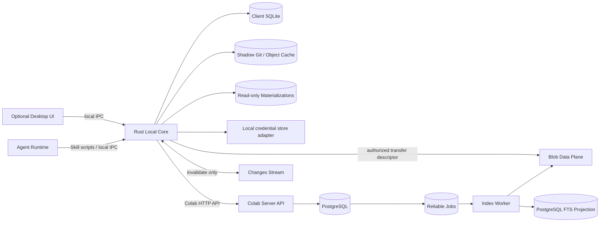
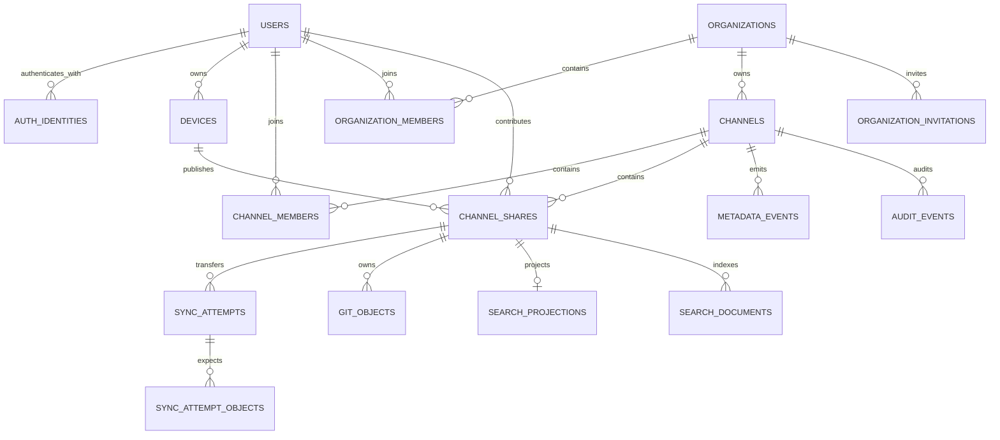
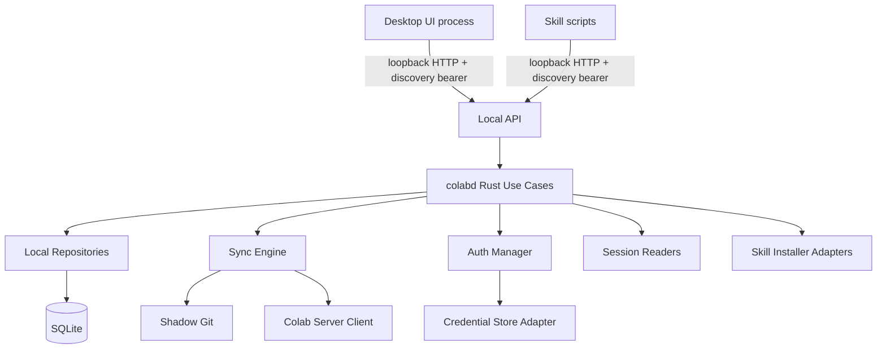
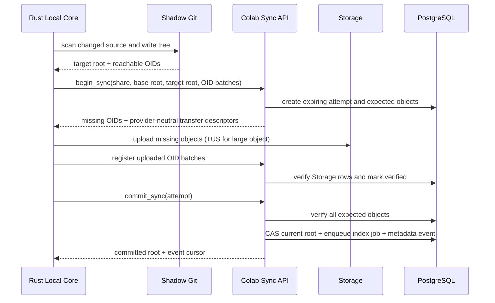
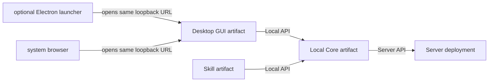

# Colab 技术设计

Activity 对象一致性（2026-10-07）：分页结果追加 actorMemberId、targetBlueprintId，不从可编辑姓名反推身份。仅在选定页之后关联触发消息，返回 160 字符/40 节点/20 层深度上限的摘要；mention 保持 kind/id/label 原子身份，label 上限 160 字符。GUI 不为每条活动再取一次消息，不预取 Session/File/Canvas 正文或 task 日志。消息、Canvas 节点与 Activity 复用同一胶囊组件。

Home 近期动态（2026-10-06）：GUI → Local Core → Server 的 `/v1/channels/{id}/activity` 按 `(occurredAt,id)` 倒序游标分页，默认 20、最大 50，各来源先 limit 再合并。共享/Canvas/指令来自现有表；新增 `share_read_activity` 仅保存每位 reader 对每个 Share 的最新成功消费时间，Server 按账号和当前 Channel membership 鉴权。Files 物化、Session read 与 Skill 的 owner-local Files use 在成功后 best-effort 上报；失败不影响原任务，不能称为完整读取审计，历史读取无法补出。不给 GUI 预取正文或全量资产；刷新/翻页显式请求。

Canvas 的 Markdown/CRDT 转换现由 Local Core 自有 ProseMirror Markdown +
Tiptap Yjs binding helper 实现，替代原手写转换。能力边界、段尾硬换行映射及
验证索引见 [Canvas 独立技术设计](canvas-technical-design.md#2026-10-04转换实现替换)。

状态：第一轮验证收敛版  
当前实现主线：独立 Rust + PostgreSQL；Supabase 原型保留但暂停继续开发  
范围：Organization、Channel、Session、Files、Skills、Settings

## 1. 当前架构结论

- 独立 Rust Local Core 是本机业务能力和后台同步的唯一进程；Desktop UI 与 Skill scripts 都是它的客户端，GUI 不运行时 Core 仍可工作；
- Files、Skill 使用独立 shadow Git tree 表达快照；不接触来源目录的 `.git`；
- Session 保留来源原始结构，大型追加文件按稳定边界拆成不可变 segment/chunk；
- 服务端只登记 Shared Item 当前 root，不提供 commit history、branch、merge 或版本恢复；
- Git objects 存 S3-compatible Blob Storage，PostgreSQL 只存传输目录和当前指针；
- 对象目录以 `(share_id, oid)` 为身份，只做 Share 内去重；
- Files 消费前同步到本机并交给文件工具；Skill 先同步制品，再安装/更新到指定 Agent 目标并交给其原生 Skill loader；Session 由专用 Reader 按来源结构分页读取；
- 实时通道只发送失效通知，数据库 current root 才是事实来源；
- 搜索是从 Blob 真源异步产生、可以删除重建的投影；
- 当前服务端主线采用独立 Rust API、Google OIDC、PostgreSQL、S3-compatible Blob、SSE 和 PostgreSQL FTS；
- 客户端只依赖 Colab Server 领域协议，不直接依赖 PostgREST、Supabase RPC 或 Storage SDK；
- 独立版使用 Rust + PostgreSQL，并替换身份、Blob、Realtime 和任务实现；两版接受同一套 Server Contract Tests。

## 2. 总体架构



边界原则：

- UI 是可选客户端，只负责展示和收集意图，不写 SQLite、不调用远端服务；
- Agent 不持有 Colab Server refresh token，只调用本机 Local API；
- Rust Local Core 独立于 GUI 生命周期，是本地业务能力的唯一入口和 SQLite 唯一写入者；
- Colab Server API 负责身份验证、Channel 权限、原子写入和短时 Blob 授权；
- Storage 只存字节，不承担 Shared Item、文件树或产品版本语义；
- Index Worker 可以理解来源内容，但其失败不能阻塞共享或下载。

## 3. 领域对象



Shared Item 是 `channel_shares` 的产品名称。`session | files | skill` 只有内容读取方式不同，共享、撤回、权限、同步和“给 Agent”语义完全相同。

## 4. 服务端数据结构

领域 schema 由 PostgreSQL migrations 管理。两种实现共享对象语义和约束，不要求逐表物理结构完全相同；涉及 `auth.users`、Storage policy、pgmq 等 Supabase 平台对象的 migration 分开放置。下列字段是领域设计约束，不要求现在一次性全部实现。

### 4.1 身份和设备

#### `users`

| 字段 | 说明 |
| --- | --- |
| `id uuid PK` | Colab 领域用户 ID |
| `display_name text` | 展示名 |
| `avatar_url text nullable` | 头像 |
| `created_at timestamptz` | 创建时间 |

#### `auth_identities`

| 字段 | 说明 |
| --- | --- |
| `issuer text` | 身份发行方；如 Google 或企业 IdP |
| `subject text` | 该发行方内稳定的 subject |
| `user_id uuid FK` | 映射到 Colab 用户 |
| `provider text` | provider 类型 |
| `email text nullable` | 展示与邀请匹配用，不作为身份主键 |

联合唯一键为 `(issuer, subject)`。Google、企业 OIDC 与其他 provider 最终都映射为一个 Colab `user_id`。

Supabase 实现以 `auth.users.id` 直接作为 `users.id`，身份凭据和 provider linking 由 Supabase Auth 管理；领域表只保留 profile。独立版自己维护 `users`、`auth_identities` 与 session。授权决策不读取 Supabase 中用户可修改的 `user_metadata`。

#### `devices`

| 字段 | 说明 |
| --- | --- |
| `id uuid PK` | 设备 ID |
| `user_id uuid FK` | 所有者 |
| `name text` | 用户可识别的设备名 |
| `platform text` | macOS/Windows/Linux |
| `public_key text nullable` | 后续设备签名能力预留 |
| `last_seen_at timestamptz` | 最近在线时间 |
| `revoked_at timestamptz nullable` | 设备撤销 |

Desktop 首版由 Local Core 把 Colab session 存在应用私有目录、权限为 `0600` 的 SQLite；不依赖 macOS Keychain。Web 使用服务端 HttpOnly/Secure cookie。凭证存储是平台 adapter，企业发行版仍可选择系统凭证库。

### 4.2 Organization、Channel 与成员

#### `organizations` / `organization_members`

Organization 是租户和人员目录边界；Channel 是 Organization 内实际发生协作的单元。`organizations` 保存 `id/name/slug/created_by/created_at`。`organization_members` 拥有独立的 `id`，并以 `(organization_id,user_id)` 保证一个账号在同一组织内只有一个 Member；角色为 `owner|admin|member`。用户在组织内的 Channel membership、创建和邀请行为都引用 Member，而不直接引用全局 User。用户首次注册时会拥有一个个人 Organization；企业 OIDC/SSO 可把账号自动映射到已配置的 Organization。

当前 Organization 是客户端针对当前登录账号保存的低频工作上下文：Desktop 在账号设置中展示、切换和创建 Organization；Local Core 按账号保存选择；Server API 仍显式携带 `organization_id`，不依赖隐式服务端全局状态。切换 Organization 后，Channel 列表整体切换。

#### `organization_identity_providers`

保存 Organization 与 OIDC/SAML issuer、可选邮箱域名的映射。认证成功后只根据受信任 issuer + subject 建立身份；邮箱域名不能单独充当身份凭证。

#### `channels`

`id`、`organization_id`、`name`、`description`、`icon_path`、`created_by_member_id`、`created_at`、`updated_at`。名称不承担全局唯一身份。Local Core 已根据当前账号与当前 Organization 取得授权资源集合后，Browser 使用完整子孙路径逐层收窄；若仍有多个候选，返回带元数据和精确 UUID ref 的歧义结果。UUID 继续用于内部关系、协议调用和歧义后的明确选择。

#### `channel_members`

联合主键 `(channel_id, organization_member_id)`；其他字段为 `role(owner|admin|member)`、`joined_at`。数据库外键保证 Channel 中出现的主体必定是 Organization Member。

首版权限规则：

- member：浏览 Channel，读取 Shared Item，共享自己的对象；
- admin：另可邀请、移除 member，修改 Channel；
- owner：另可管理 admin，且不能被普通删除流程移除。

权限在 Colab Server API 的 use case 中显式检查。Supabase 实现的 public schema 仍启用 RLS，防止 Data API 被绕过 API 入口直接访问；产品权限语义不依赖 RLS，独立版在 Rust use case 中执行同一规则。

#### `organization_invitations`

`id`、`organization_id`、可选 `channel_id`、`email`、`organization_role`、`channel_role`、`token_hash`、`invited_by_member_id`、`expires_at`、`accepted_at`、`revoked_at`。

组织内成员通过人员目录搜索后可直接加入 Channel。组织外用户无论是否已有 Colab 账号，都必须通过邮件明确接受；接受动作在一个事务中加入 Organization 和目标 Channel。只保存邀请 token hash；原 token 只出现在邀请链接中。

#### 邮件发送边界

成员 use case 只产生 Organization Invitation，不直接拼 SMTP。`EmailSender` 端口由部署适配器实现：独立 Rust 服务端使用 `lettre` 的通用 SMTP/TLS transport，模板使用 `minijinja`。开发环境接 Mailpit；正式环境可以接自建 Postfix/Postal，或任何标准 SMTP 服务。Cloudflare 只托管 DNS，不进入邮件发送依赖。正式上线前增加 transactional outbox、幂等发送键和退避重试，使数据库事务不依赖邮件服务器瞬时可用性。

### 4.3 Shared Item

#### `channel_shares`

| 字段 | 说明 |
| --- | --- |
| `id uuid PK` | Shared Item ID |
| `channel_id uuid FK` | 所属 Channel |
| `contributor_id uuid FK` | 所有者 |
| `source_device_id uuid FK` | 当前发布来源设备 |
| `kind text` | `session/files/skill` |
| `name text` | 展示名称 |
| `summary text nullable` | 人或 Agent 提供的简介，不是真源 |
| `source_adapter text` | 如 `codex-session-v1`、`filesystem-v1` |
| `current_root_oid text nullable` | 当前可读快照 |
| `state text` | `active/withdrawn` |
| `created_at/updated_at` | 时间戳 |

Shared Item 名称同样是可读选择器，不强制承担唯一身份。对人和 Agent 默认暴露 Channel 名称与 Shared Item 名称；完整路径仍歧义时才返回候选元数据和精确 UUID ref。数据库主键、Blob key 和并发控制始终使用 UUID/OID，二者不混为一层。

Files 首版已实现 `shadow-git-v1`：Local Core 在应用私有目录创建外置 shadow Git，不向来源目录写入 `.git`；首次 revision 上传完整 Git pack，后续 revision 以当前已发布 root 为 parent 生成 thin incremental pack。Server 对 parent 使用 CAS，成功后才推进 `current_root_oid`。消费方按 revision 顺序把 pack 导入本地 object database，再将当前 root 原子物化到应用数据目录。Server 的 Blob Store 首个 adapter 是本地文件系统，业务接口不依赖其路径布局，部署阶段可替换为 S3-compatible adapter。

Files 来源选择是一个产品动作，不存在“先点共享、再决定文件或目录”的第二层。Electron 使用单次 native dialog 同时返回文件或目录；普通浏览器调用 Local Core 的同语义 picker endpoint。随后 Local Core 依据路径类型执行单文件或目录扫描。受能力约束必须为目录的 Skill source picker 才允许使用 directory-only 模式，该约束不能泄漏回 Files 交互。

每个 Files 来源的 Colab 专属排除规则只存于该 shadow Git 的 `$GIT_DIR/info/exclude`，这是唯一真源，也是 `git add` 实际消费的标准位置。GUI 查看或编辑同步范围时，Local Core 直接读取或重写该文件；SQLite 只记录 `share_id`、来源路径与 shadow Git 路径，不复制排除规则。来源项目自身的 `.gitignore` 仍由 Git 正常读取，Colab 只读、不修改。同步范围是低频管理操作，不为它额外建立数据库索引或重建协议。

当前 Local Core 使用操作系统文件 watcher 监听已登记来源；事件只负责更新 SQLite `local_jobs` 的 publish job，并把 due time 推迟到 2 秒静默窗口之后。独立 worker 原子 claim 后调用统一的 `publish_source`，后者仍执行完整 shadow Git 扫描。generation 在 job 执行期间继续递增，旧 generation 完成时若发现新事件便把 job 留在 pending，避免上传期间的修改丢失。首次登记走同一持久化任务，durable job 接受后立即返回 `preparing`；失败记录错误并按 2、4、8 秒指数退避（上限 5 分钟），手动重试可立即推进。Core 启动把遗留 running lease 恢复为 pending。同步不绑定 Desktop GUI 生命周期。
| `withdrawn_at timestamptz nullable` | 撤回时间 |

没有 `object_version`、`file_entries`、`session_messages`、`skill_versions` 等服务端表。内部内容由 root tree 指向的原始快照表达。

### 4.4 同步传输

#### `sync_attempts`

短期存在的传输事务，不是产品版本。

`id`、`share_id`、`device_id`、`base_root_oid`、`target_root_oid`、`state(preparing|uploading|committed|failed|expired)`、`expected_count`、`expires_at`、`created_at`、`committed_at`。

#### `sync_attempt_objects`

联合主键 `(attempt_id, oid)`；字段 `size`、`state(missing|uploaded|verified)`。用于分批登记一个 attempt 期望的 OID，并保证 commit 前没有漏传。attempt 过期后整批删除，它不是长期 manifest。

#### `git_objects`

联合主键 `(share_id, oid)`；字段 `storage_path`、`size`、`created_at`、`last_referenced_at`。

Storage key 固定为：

```text
git-objects/{channel_id}/{share_id}/{oid}
```

数据库不保存文件相对路径。文件路径只存在 Git tree 字节中；`storage_path` 是对象存储地址，不是文件目录元数据。

#### `sync_jobs`

可靠异步 outbox：`id`、`share_id`、`root_oid`、`kind(index|gc)`、`state`、`attempts`、`next_attempt_at`、`last_error`、`created_at`、`completed_at`。`unique(share_id, root_oid, kind)` 保证幂等。

root CAS 与 index job 必须在同一个 PostgreSQL 事务提交。pgmq/worker 负责消费；Cron 扫描卡住的 pending/failed job。

### 4.5 搜索

#### `search_projections`

主键 `share_id`；字段 `root_oid`、`state(pending|indexing|ready|failed)`、`indexed_at`、`error_code`、`error_detail`。

#### `search_documents`

`id`、`channel_id`、`share_id`、`root_oid`、`locator jsonb`、`title`、`plain_text`、`fts tsvector`。

`locator` 只描述如何回到原文：Files/Skill 是相对路径与行号；Session 是来源 reader 的 turn/message locator。查询必须同时满足：Channel 成员权限、Share active、document root 等于 Share current root。

索引是派生数据，可以整表删除重建。首版使用 PostgreSQL FTS；pgvector 不进入首版。

### 4.6 事件与审计

#### `metadata_events`

单调 `id bigint` 作为 cursor；字段 `channel_id`、`entity_type`、`entity_id`、`operation`、`occurred_at`。客户端断线后按 cursor 拉取变化。Realtime 只通知“有新 cursor”，不承担可靠事件日志。

#### `audit_events`

记录管理和安全动作：`id`、`actor_id`、`channel_id`、`action`、`object_ref`、`metadata jsonb`、`created_at`。不把普通文件读取全部写成高成本审计，具体审计范围在企业需求出现后扩展。

## 5. 客户端数据与磁盘结构

客户端 SQLite 是缓存与本机任务事实来源，不复制服务端所有表。

### 5.1 SQLite tables

| 表 | 关键字段 | 角色 |
| --- | --- | --- |
| `accounts` | `user_id, email, display_name, avatar_url, session_json, last_used_at` | 已登录账号和 Colab session；仅由 Local Core 读写 |
| `local_settings` | `key, value` | 当前账号等本机设置 |
| `channel_cache` | `channel_id, name, icon_ref, role, updated_at` | Channel 缓存 |
| `member_cache` | `channel_id, user_id, role, display_name, updated_at` | 成员缓存 |
| `share_cache` | `share_id, channel_id, kind, contributor_id, current_root_oid, state, updated_at` | Shared Item 元数据缓存 |
| `local_sources` | `share_id, adapter, source_locator, shadow_git_dir, watch_state, last_published_root, last_scan_at` | 本机贡献来源 |
| `object_stores` | `share_id, git_dir, last_gc_at` | 本地 Git object database 位置 |
| `materializations` | `share_id, root_oid, local_path, state, lease_count, last_accessed_at` | 消费侧只读物化 |
| `local_jobs` | `id, dedupe_key, kind, share_id, user_id, state, generation, attempts, next_attempt_at, last_error` | publish/materialize 持久化 outbox；generation 防止运行中事件丢失 |
| `sync_cursors` | `channel_id, metadata_cursor, last_success_at` | 元数据补偿游标 |
| `local_session_catalog` | `catalog_id, provider, thread_id, name, source_path, source_adapter, size_bytes, mtime_ns, updated_at` | 三类 Agent 本机会话清单索引；`catalog_id` 区分跨项目重名 thread，只存元数据，不存对话正文 |

不建立本地 `file_entries` 表。shadow Git index 已经表达文件扫描状态；filesystem watcher 提供候选变更，watch overflow 或不可信时做完整 rescan。避免数据库再维护一份容易漂移的目录镜像。

同理，不在 SQLite 保存 Files exclude。`local_sources.shadow_git_dir` 足以定位 `$GIT_DIR/info/exclude`；该文件与 shadow index 同属 Git 执行状态，GUI 按需读取即可。

Session 来源发现与内容同步分离：Local Core 启动后立即、此后每 60 秒扫描 Codex、MyFlicker 和 Claude Code 的会话目录。MyFlicker 必须同时覆盖新版 CLI `~/.myflicker/projects/*/*.jsonl`、旧版 CLI `~/.codeflicker/projects/*/*.jsonl` 和 Desktop `~/.myflicker/sessions/*/message/cache.jsonl`；两类 CLI 共用 reader，Desktop 的覆盖记录、rollback 和 tool-call 结构由独立 adapter 投影，所有 `requests/` 请求碎片均排除。扫描先比较文件大小和纳秒级 mtime，只有变化的 JSONL 才有界读取前 80 行以更新标题；原始文件仍是真源。GUI 和 Skill 的清单/搜索请求只查询 `local_session_catalog`，支持名称及 thread/session ID 模糊搜索，不在交互请求中遍历或读取会话文件。跨项目重复 thread ID 由本机稳定的 `catalog_id` 消歧；它不是远端资源 ID，也不会进入共享路径。

### 5.2 App Data 目录

App Data 必须由操作系统目录 API 决定，不能相对当前工作目录。macOS 当前落在 `~/Library/Application Support/online.agent-colab.Colab/`；Windows/Linux 使用各自标准应用数据目录。展示给人和 Agent 的物化目录采用 `贡献者/共享名称`，内部 UUID 只用于数据库、对象库与协议寻址。

```text
<app-data>/
├── colab.sqlite
├── shadows/
│   └── {share_id}/
│       ├── git/                 # 来源侧独立 Git dir/index
│       └── session-segments/    # 仅 Session adapter 使用
├── objects/
│   └── {share_id}/git/          # 消费侧 Git object database
├── materialized/
│   └── {share_id}/{root_oid}/   # 原子生成的只读快照
├── staging/
│   └── {job_id}/                # 下载和 checkout 临时目录
└── logs/
```

来源绝对路径、session key 与 agent 产品本地位置只存在来源设备的 `source_locator`。服务端永远看不到用户的绝对路径。

## 6. 服务与模块划分

### 6.1 Rust Local Core 与可选 Desktop UI

GUI 存在时，本机是两个独立进程；GUI 不存在时只有 Core。`colabd` 是可以脱离 Desktop 安装和运行的 Rust 后台进程；Desktop UI 是可选客户端，不拥有业务状态：



- **`colabd`**：无头运行的 Rust Local Core；拥有业务状态、后台任务和本地资源；
- **Desktop UI**：Tauri 或 Electron 均可，只负责 Channel rail、Sessions/Files/Skills/Settings、选择器、进度与错误展示；
- **Rust Use Cases**：创建 Channel、成员管理、共享、撤回、同步、物化、搜索；
- **Auth Manager**：PKCE、loopback/deep-link callback、session refresh、账号切换与凭证存储；
- **Sync Engine**：shadow tree、批量求缺、TUS 上传、CAS commit、下载与物化；
- **Source Adapters**：filesystem、Codex session、未来其他 agent session；
- **Skill Installer Adapters**：把已验证的 Skill artifact 安装或更新到 Codex、Claude Code、MyFlicker 等目标目录，保存安装 receipt，并把后续使用交还目标 Agent 的原生 loader；
- **Local Repositories**：SQLite 唯一写入与事务；
- **Local API Adapter**：由 `colabd` 暴露；统一使用带随机 bearer 的 loopback HTTP 和仅当前用户可读的 discovery file，不再并行维护 Unix socket/named pipe；GUI 和 Skill scripts 通过同一 API 调用同一 use case；
- **Platform Adapters**：watcher、可选系统凭证库、系统浏览器、托盘、开机启动。

同一个 `dedupe_key` 的本地任务只执行一次。退出 GUI 不影响 `colabd`；Core 由 launchd/systemd/Windows Service、显式执行 `colabd start`，或首次 Skill 调用按平台策略启动。用户可单独停止 Core，停止前应完成 SQLite checkpoint 并安全挂起本地任务。

不运行 Node.js 或 Python 本地业务服务。即使 Desktop UI 最终采用 Electron，其 Node main process 也只是 GUI 宿主和 Local API client，不接管 Core。Node.js 继续用于前端构建和验证脚本；Python 不进入桌面运行时。

### 6.2 Colab Server 领域 API

客户端只认识以下能力组：

| 能力 | 稳定语义 | 不暴露的实现细节 |
| --- | --- | --- |
| `auth` | discovery、开始登录、交换 code、refresh、logout | Supabase Auth / 独立 OIDC broker |
| `channels` | Channel CRUD、成员、邀请 | PostgREST、SQL function、Rust handler |
| `shares` | Shared Item CRUD、撤回、current root | 数据表名称与 RLS |
| `sync` | begin、分批登记 OID、取得传输 descriptor、commit、current | Storage SDK、bucket policy、S3 credentials |
| `changes` | cursor pull；可选实时失效通知 | Supabase Realtime / WebSocket / SSE |
| `search` | 查询当前 root 的派生索引 | PostgreSQL FTS SQL |

`GET /v1/capabilities` 返回后端版本、支持的登录方式、上传协议、单批上限和 realtime transport。它用于协商已定义的可选能力，不是任意插件系统。

大对象传输通过 descriptor 表达，例如 `{method, url, headers, protocol, expires_at}`。Supabase 可以返回 TUS/direct Storage URL，独立版可以返回 S3 multipart URL；Local Core 只实现明确支持的 `tus | s3-multipart | single-put` transport。

### 6.3 Supabase 实现（冻结）

- **Auth**：Google/OIDC 登录、user/session/refresh；
- **PostgreSQL/RPC**：Channel、成员、Share、同步 attempt、root CAS、对象目录、事件 cursor；
- **Edge Functions**：邀请、复杂权限、批量签名 URL、外部回调、Indexer 入口；
- **Storage**：private Git objects，TUS 断点续传；
- **Realtime**：Channel 元数据失效通知；
- **pgmq + Cron**：索引、GC、邮件和失败补偿；
- **FTS**：当前 root 的关键词索引。

Supabase Edge Functions 是 Colab Server API 的入口，客户端不直接调用 Supabase RPC/PostgREST。简单原子逻辑可由 Function 调用 PostgreSQL function；需要 secrets、外部网络或签发 Storage descriptor 的逻辑留在 Function。重 CPU 工作不能放 Edge Function：托管平台当前每请求 CPU 时间有限，应进入后台任务。[Supabase Edge Function limits](https://supabase.com/docs/guides/functions/limits)

Supabase Auth 的 OAuth 页面仍可直接由系统浏览器访问，但 authorize URL 由 Colab Server auth discovery/SDK adapter 生成，业务模块不读取 Supabase 专属 session 结构。

该实现保留已有 migration、验证原型和能力结论，但当前实现阶段不新增功能、不追求与 standalone 同步。等独立 Rust 主线完成 Channel/成员、Files 同步和 Shared Item 闭环后，再决定是否恢复。

### 6.4 独立 Rust 实现

建议组件：

- HTTP API：Rust `axum`/`tower`；
- 数据库：PostgreSQL + `sqlx` migrations；
- 身份：OIDC authorization-code + PKCE；Google 和企业 IdP 作为 provider，服务端发行 Colab session；
- Blob：S3-compatible API，默认支持 MinIO/云对象存储；单机演示可用受控文件目录；
- Realtime：WebSocket 或 SSE 只发送 cursor invalidation；
- Jobs：PostgreSQL outbox + `FOR UPDATE SKIP LOCKED` worker；
- Search：PostgreSQL FTS；
- 部署：API 与 worker 可同一二进制用不同 subcommand，也可拆进程扩容。

独立版不模拟 Supabase 的 RLS、PostgREST、Realtime protocol 或 Storage schema；它只实现 Colab Server API 的业务语义。Supabase 与 Rust 版分别拥有 adapter/integration code，通过同一套黑盒 Contract Tests 保证行为一致。

### 6.5 协议所有权，而不是 `shared/`

不设置含义宽泛的顶层 `shared` 模块。跨制品关系按“服务提供方拥有协议、消费方生成或实现 client”处理：

| 协议 | 所有者 | 消费者 |
| --- | --- | --- |
| Local API OpenAPI/JSON Schema | `local/api/` | Desktop、Skill scripts |
| Colab Server API OpenAPI/JSON Schema | `server/api/` | Local Core、第三方服务端实现者 |
| `colab://` canonical ref schema | `server/api/schemas/` | Local Core、Desktop、Skill |
| Server Contract Tests | `server/tests/contract/` | 当前验收 standalone；Supabase 恢复后复用 |

Desktop 与 Rust client 的 DTO、错误码、cursor 和状态机由协议 schema 生成到各自构建目录；Python Skill 保持标准库薄 client，用相同 schema 产生的 fixture 做一致性测试。不把这些生成物做成第三个共享源码包。Git OID 校验等少量纯逻辑，只有在出现三个以上真实消费者后才提取独立 crate；首版分别放在 `local` 与 `server` 的所属模块中。

Supabase Function、Rust handler、Auth、Storage authorization、job worker 都属于各自服务端实现，不共享基础设施代码。这样既防止客户端被 Supabase SDK 锁死，也避免为代码复用制造脱离制品边界的目录。

### 6.6 Agent Scaffold

`skills/colab` 是独立发布制品，包含薄脚本和使用说明：

- `colab-browser`：Channel/Shared Item 浏览、管理、共享、撤回、Files 消费和搜索；
- `colab-session-reader`：已实现来源 Session 的增量同步、snapshot-pinned 游标阅读、`includeOutputs` 与单项输出裁剪；
- `colab-skill-tool`：发现本机 Skill 来源，并对共享 Skill 执行指定目标 Agent 的 status/install/ensure/check-update/update/uninstall；Local Core 持有安装 receipt、冲突检测与用户修改保护；
- `colab-open`：面向“打开/调起 Agent Colab 页面”的独立入口；启动或唤醒 Local Core，再打开带本机 bootstrap token 的 GUI。它不复用 `colab-browser open`，后者只负责资源发现；
- 脚本自己实现 Local API client，不依赖额外的 `colab` CLI 制品，也不直接请求远端服务；
- Files 的 `use` 返回本地路径后直接使用文件工具；Skill Tool 负责把共享 Skill 变成目标 Agent 真正可发现的已安装能力，不能只返回一个临时目录；Session Reader 自行取得和解释 Session 快照。

#### Shared Skill 来源、版本与安装

Skill 与 Files 共用 shadow-Git 快照和 Git pack 传输协议，但消费语义不同。Skill 的共享单位是一个包含合法 `SKILL.md` 的具体根目录；自动发现的 Agent Skill 和用户明确选择的开发目录在持久化层都是同一种 `source_path`，只保留发现目标作为辅助元数据。

Local Core 通过目标 adapter 扫描并监听 Codex、Claude Code、MyFlicker 的 Skill 根目录。`local_skill_catalog` 保存可重建元数据：`source_id, source_path, name, description, discovered_targets, last_changed_at`。同一 canonical path 只登记一次。48 小时推荐只依据目录创建或内容变化时间，并排除当前 Channel 已共享的来源；不推断“使用证据”，不自动共享。

一旦共享，watcher 与 Files 相同：两秒静默窗口后由持久化 job 完整重扫，shadow Git 生成新快照；`root_oid` 就是 Colab 的 Skill 内容版本，不增加 `skill_versions` 或依赖作者维护语义版本。服务端使用 `channel_shares(kind='skill')`、`file_revisions` 与 Blob Store 保存当前指针及不可变 pack。

消费侧先把共享快照物化到应用数据目录，再由 `SkillInstaller` adapter 安装到目标 Agent。`skill_installations` receipt 至少记录 `share_id, target_agent, installed_path, installed_root_oid, content_hash, managed_by_colab, installed_at`。检查更新比较 `installed_root_oid` 与共享 `current_root_oid`。安装、更新与卸载只操作 receipt 明确归 Colab 管理的目标；同名非托管目录或检测到用户修改时返回冲突，绝不静默覆盖。目标 adapter 同时返回立即生效、需要新会话或需要重启等 activation 状态。

撤回只终止 Channel 中的发现和后续更新，不远程删除其他成员设备上已经安装的副本。本地 receipt 将其视为来源不可用，用户仍可主动卸载。

#### Git pack 传输护栏

当前 standalone alpha 将一次 shadow-Git 变更编码为一个 opaque Git pack，再通过单次 HTTP 请求写入 Blob。它复用 Git 的对象与增量语义，但不是执行远端 `git push`，也还不具备 Git smart protocol 的协商。Local Core 必须在 `pack-objects` 前检查 index：单文件超过 100 MiB、总内容超过 200 MiB时直接返回可操作错误。Server 不把请求整体加载进内存，而是流式写临时文件，在 256 MiB 硬边界内完成 `fsync` 和原子改名；下载同样从 Blob 流式输出。Files/Skill 的 active revision history 共享每贡献者 2 GiB 配额，配额判断通过 PostgreSQL advisory transaction lock 串行化；每小时 GC 根据数据库可达性回收失败上传、已撤回 Channel Share 和已过期 Transfer 的 Blob，并为在途写入保留一小时 grace period。分块/断点续传仍是后续 transport 改进，不改变版本模型。

创建共享对象只负责登记 durable publish job，并立即以 `preparing` 返回；GUI 从任务真源展示 `syncing / failed / ready`，不能用固定 HTTP 等待期限把仍在后台运行的任务误报成失败。未来支持更大共享对象时，应把 transport 升级为可恢复的分块 Blob upload；该变化只属于传输层，不改变 watcher、shadow Git 和 `root_oid` 的语义。

### 6.7 本机制品更新与进程切换

Setup 先下载、验签、校验 hash，在版本目录中完成 staging，再原子切换 `current/core`、`current/ui` 与 `current/skill`。运行中的 Core 不覆盖自身，也不在 HTTP 响应尚未返回时重启。由 LaunchAgent 管理时，Core 在更新响应返回后延迟退出，launchd 从新的 `current/core` 拉起；非托管启动只报告需要重启。

发布清单允许同一组件出现多个 `platform + arch` 变体；GUI 与 Python Skill 是通用制品，Local Core 和 Electron 按当前平台选择。macOS setup 使用 launchd 与目录 symlink；Windows setup 把状态放在 `%LOCALAPPDATA%\AgentColab`，使用无需 Developer Mode 的 directory junction 激活不可变版本，并以用户级 Task Scheduler 任务托管 Core。Windows 更新在响应返回后退出旧 Core，再由脱离旧进程生命周期的延迟任务启动新版本。

Local Core 首次安装时选择 OS 随机 loopback 端口并生成高熵 bearer，随后把二者作为安装级 rendezvous identity 保存在 mode-0600 discovery 中；进程重启只更新 PID，不改变浏览器 origin 和 HttpOnly cookie。更新由 Local Core 调用 setup 激活制品并在响应送达后退出，launchd 在同一端口拉起新进程。GUI 仅在这次显式更新操作中，以有限时长探测同源 `/v1/status`，确认 PID 已变化后 reload。该流程在普通系统浏览器和 Electron 中完全一致；Electron 只在初次打开窗口时读取 discovery，不运行常驻检查。

## 7. 同步协议

### 7.1 发布



只有 `commit_sync` 成功才对其他成员可见。上传一半的 objects 是不可见的临时数据，attempt 过期后由 GC 删除。

同一 Share 在客户端只允许一个 commit in-flight；watcher 产生的新变化合并进下一次 tree。CAS 冲突不做 merge：来源设备读取服务端 current root，重新发布自己最新的完整快照。

### 7.2 消费

1. 读取 `share_cache.current_root_oid`，必要时向服务端刷新；
2. root 与本地 materialization 相同则直接复用；
3. 下载 root tree object，逐层解析 tree 并求出本机缺失 OID；
4. 批量取得短时下载授权，并发下载；
5. 每个 object 用 Git OID 校验，任何不一致都丢弃重试；
6. 在 staging 中 `read-tree/checkout-index`；
7. 完成后原子 rename 到 `{share_id}/{root_oid}`；
8. SQLite 事务切换 materialization；旧目录在 lease 为零后回收。

### 7.3 Session

Session connector 无损读取来源原始文件或 API 输出。大文件按稳定边界生成不可变 chunks，并生成一个描述重组顺序、来源 adapter 与读取元数据的根文件。新增对话只生成新 chunks 与新 root，不重传历史大 blob。Session Reader 在本地重组或逐 chunk 分页，不把 messages 转成服务端关系表。

已落地实现明确区分三个位置：贡献端 SQLite 的 `last_byte_offset` 是原始来源同步游标；服务端 `current_snapshot_id` 固定一条不可变 segment 链；Reader 的 opaque cursor 绑定该 snapshot，只负责 turns 分页。正常追加只上传来源游标之后、且以换行结束的完整 JSONL 记录；来源被截断时从 0 建立新基线。每次同步先冻结本轮来源长度，以约 8 MiB 为目标边界聚合完整 JSONL records，每个 Server 已接受的 segment 都立即推进 SQLite source cursor 与 parent snapshot；网络失败从最后一个持久化边界恢复，不重传整份历史。单条 record 不拆分，超过 32 MiB 时明确拒绝并返回来源异常。贡献端 source registration 必须按当前登录 user 查找；另一账号即使共享同一台设备，也只能物化远端 snapshot，不能借用贡献者本地路径上传。

服务端只保存 `channel_shares(kind=session)`、`session_snapshots`、`session_segments` 与 Blob，不加载 provider adapter。消费端逐个流式下载缺失 segment 到磁盘，并依据 manifest 在应用数据目录原子生成 snapshot JSONL；服务端和网络层都不拼装一份完整 Session 响应。Local Core 的 Codex、MyFlicker、Claude Code adapter 在 Agent 明确读取时投影为 `session/snapshot/turns/page/freshness`。Python `colab-session-reader` 只是 Local API 薄客户端，不读取凭证或缓存、不复制 adapter。GUI 清单不调用 Reader、不预览正文，只展示 metadata 与最近一次已提交快照的时间。

稳定边界优先使用来源自身的 turn/record 边界；Codex JSONL 首版按完整 turn 关联的连续原始 records 分 segment，不能拆断单条 JSON record。每个 root manifest 只记录来源 adapter/schema、ordered segment digests、可安全共享的 session 元数据和读取边界。Server 只保存 Share 当前 root、不可变 manifest/segment blob 和同步所需的 snapshot 记录；它不解释 message/tool schema。来源只追加时上传新 segment 和新 manifest；来源发生尾部修订时只重建受影响尾段，无法确认稳定边界时安全退化为新完整 snapshot。同一 Local Core 内，同一 Share 的定时、显式和 Reader 触发同步必须使用 share-scoped mutex 串行执行，避免两个调用者携带同一 parent snapshot 并发 CAS。

消费端在应用数据目录保存按账号隔离的 manifest/segment 缓存与 adapter 索引。Reader 读取时把原始结构投影为 Codex-shaped turns；该投影是消费协议，不是持久化格式。opaque cursor 同时绑定 Share、root/revision、adapter 与分页位置，拒绝跨 snapshot 混用。工具输出裁剪发生在最终响应阶段，因此同一原始 snapshot 可以按不同 `includeOutputs`/长度参数读取，无需重新同步。

### 7.4 Quick Share capability

Quick Share 是独立的 `transfer` aggregate，不复用 Organization、Member、Channel 或 `channel_shares` 伪装临时成员关系。服务端只保存固定快照、对象类型、创建时间、到期时间、撤销状态、配额计数和 capability token 的 hash；原始 token 只在创建时返回一次。读取 API 先校验 token hash、到期、撤销和限流，再返回本 Transfer 明确列出的对象，绝不允许由 token 枚举账号、Organization 或 Channel。

Standalone Server 的实际落地使用 `quick_transfers`、`quick_transfer_items` 与 `quick_transfer_accesses`。每个 Transfer 严格只含一个 item；Server 与 Local Core 都执行该约束，防止旧客户端重新引入批量分享。创建时分别生成 upload/read/revoke 三个 256-bit capability，避免可转发的读取凭证获得追加或撤销权；数据库按来源 IP 执行跨进程滚动创建限额。item 以流式 I/O 写入临时 Blob，同时计算 SHA-256，经过单 item 256 MiB 和单 Transfer 512 MiB 限额后原子改名并提交元数据。`finalize` 只在 item 已持久化后将状态从 `uploading` 推进到 `ready`，之后不再允许修改，因此消费端看到的是固定清单。到期或撤销会立刻使查询失效；周期 GC 先删除 Blob、再删除 PostgreSQL 元数据，删除失败则保留记录供下一轮重试。

贡献端 Local Core 复用 Files/Skill shadow Git，并在 Session 上传前复制已冻结的原始 provider 文件；Quick Share 创建完成后不注册 watcher，也不持续追踪来源。默认 TTL 为 24 小时，服务端设部署级最大 TTL、单 Transfer 大小和下载次数限制；创建者可用独立 revoke capability 延长/缩短有效期或提前撤销。创建端 Local API 只返回可转发的 read capability，revoke token 与来源显示元数据只保存在私有 SQLite receipt，因此 `Manage shared items` 不需要把管理权限交给浏览器持久化。

接收端 Local Core 第一次使用时生成稳定、随机且不含设备信息的 reader ID；读取 manifest 时发送该 ID，并在已有 Colab session 时附带登录身份。Server 只保存 reader ID 的 hash，把多次拉取聚合为一次访问者记录；已登录者显示账号名称与头像，未登录者只显示“匿名接收者”。该记录用于创建者管理界面，不是社交 read receipt，也不向 capability 持有人公开其他访问者。接收端把 item 物化到独立 `transfers/` 缓存，流式下载时计算 SHA-256 并在校验成功后原子落位；不能把 token 写入日志、可读文件名或普通资源 URI。

未安装场景使用稳定的公开 bootstrap 命令下载并校验签名后的 Agent Colab Skill/setup；setup 只安装本机制品，真正读取仍由提示词中的一次性 capability 完成。Electron 是可选入口，不能成为消费 Quick Share 的前置。

## 8. 元数据一致性与 Realtime

每次 Channel、成员、Share 或 current root 变化，都在业务事务中写 `metadata_events`。客户端正确性依赖 cursor pull：

```text
Realtime 通知 / App 唤醒 / Agent 请求
  → pull_changes(channel, after_cursor)
  → SQLite 单事务应用 channel/member/share delta
  → 最后推进 sync_cursors.metadata_cursor
```

没有 WebSocket 时，变化会在下次 App 激活、打开 Channel、Agent 调用或低频后台刷新时补齐；有 WebSocket 时只是更快触发同一个 pull。这样断线、重复通知和乱序都不影响正确性。

## 9. 身份流程

Desktop 使用 Google 原生应用的 OAuth authorization code + PKCE；Supabase 路径暂停：

1. Auth Manager 生成 verifier/challenge/state；
2. Local Core 从真实 Google Desktop credential 生成 authorize URL，由系统浏览器打开；
3. Google 回调 Local Core 的随机 loopback 端口；
4. Local Core 校验 state，将一次性 code、PKCE verifier、nonce 和 redirect URI交给 Rust Server；
5. Rust Server 向 Google token endpoint 交换 token，并以 Google discovery/JWKS 校验 ID token；
6. Server 用 Google `(issuer, subject)` 建立用户并签发可撤销的 Colab opaque session；
7. Colab session 写 Local Core 独占的 SQLite；Local API 不返回 token，Agent runtime 不可读取凭据。

Colab session 使用短路由内统一解析的 opaque access token 和一次性 refresh token。Server
为每个 session family 保存 refresh token 的哈希代际；成功刷新会在单个 PostgreSQL 事务内
消费旧 token、签发并记录新 token、替换 access token。已消费 token 再次出现属于 replay，
Server 立即撤销整个 family。Local Core 用单飞锁串行刷新，在 access token 到期前 60 秒恢复，
并先把新 token pair 原子写入私有 SQLite，再向其他本地调用者公开；GUI 和 Skill 永远拿不到凭据。

组织邀请事务同时写 `organization_invitations` 与 `email_outbox`，API 只返回 `queued`，不把
邮件 provider 延迟或短暂故障扩散成业务失败。Worker 通过 `FOR UPDATE SKIP LOCKED` 获取两分钟
lease，失败按指数退避（上限一小时），进程重启后可重新领取过期 lease；成功发送即删除 outbox
行，避免继续保存明文短期邀请 token。SMTP/Cloudflare 只作为 email port adapter，不进入邀请领域逻辑。

Google 登录继续使用 loopback `http://127.0.0.1:{ephemeral-port}/auth/callback` 与 PKCE。设备登录增加安装专属 Ed25519 凭据：私钥仅存在 Local Core 的私有 SQLite，Server 用限时、单次、用途和账号绑定的 challenge 验签并签发原有账号 session。设备不是权限主体；一个设备可绑定多个账号，首次未知设备创建普通账号和个人 Channel，一个有效绑定自动登录，多个绑定必须选择。撤销后保留设备记录，不自动创建替代账号。Google 是主要外部身份；新 Google 身份可绑定当前自动创建账号，已有身份选择原账号，绝不自动合并。详见 `onboarding-design.md`。不建设密码登录或新的身份提供商。

## 10. 工程目录结构

源码目录按发布或部署单元组织。`desktop`、`local`、`server`、`skills` 彼此平行，不再用泛化的 `app/` 和 `shared/` 把不同制品混在一起：

```text
agent-colab/
├── .trial/                         # 可丢弃验证原型与报告
├── desktop/
│   ├── shell/                       # 可选 Electron launcher artifact
│   ├── ui/                          # Desktop GUI artifact：React/Vite 可独立更新资源
│   └── tests/
├── local/                           # Local Core artifact 源码
│   ├── api/                         # Local API OpenAPI/schema；由本目录拥有
│   ├── crates/
│   │   ├── daemon/                  # colabd 生命周期与启动
│   │   ├── core/                    # Rust use cases
│   │   ├── local-api/               # socket/pipe/loopback adapter
│   │   ├── sources/                 # filesystem/session adapters
│   │   ├── sync/                    # shadow Git 与远端同步
│   │   ├── persistence/             # SQLite
│   │   └── platform/                # keychain/watcher/service manager
│   ├── packaging/                   # 独立 colabd 安装包/service definitions
│   └── tests/
├── server/                          # Server deployable 源码
│   ├── api/                         # Server API OpenAPI/schema；由本目录拥有
│   ├── supabase/                    # Supabase 部署实现
│   │   ├── migrations/
│   │   ├── functions/
│   │   └── tests/
│   ├── standalone/                  # Rust + PostgreSQL 部署实现
│   │   ├── crates/
│   │   ├── migrations/
│   │   └── tests/
│   ├── tests/contract/              # 两种实现共用黑盒测试
│   └── deploy/                      # container/helm/compose 等部署材料
├── docs/                            # 产品、交互与技术设计
├── skills/
│   └── colab/
│       ├── SKILL.md
│       ├── bin/
│       │   ├── colab-browser
│       │   └── colab-session-reader
│       ├── lib/                     # scripts 内部复用的 Local API client
│       ├── packaging/               # Skill artifact manifest/build
│       └── references/
└── dist/                             # 发布阶段才创建
```

制品和部署单元关系是：



首次 Desktop 安装包可以捆绑 GUI、`colabd` 和 Skill，但 Shell、GUI、Local Core、Skill 始终分别版本化和独立产出；无 GUI 环境只安装 Local Core 与 Skill。发布频道的 promotion/release id 只表示一份已签名的制品组合，不充当各制品版本。各源码单元拥有自己的 `VERSION`，安装 receipt 用 `componentVersions` 记录实际版本；统一“检查/更新”逐项比较，仅下载和激活版本发生变化的制品。Electron 没有代码变化时保持原版本，也不重新构建。协议依赖固定为：`desktop/skill → local/api → local core → server/api → server implementation`。GUI 不被 Core 反向依赖。

## 11. 技术栈定案

### 11.1 Electron Shell 与 Desktop GUI artifacts

| 层 | 选择 | 理由 |
| --- | --- | --- |
| UI | TypeScript + React + Vite | 交互生态成熟，页面逻辑与 Core 隔离 |
| Desktop launcher | Electron | 提供普通桌面 App 入口、窗口和 deep link；Windows 首次启动可引导安装内置种子制品，但不承担业务能力或后续更新决策 |
| UI state/query | TanStack Query；局部状态用 Zustand | 服务端状态与页面状态分开，避免自造缓存层 |
| 表单与校验 | React Hook Form + Zod | 设置、邀请和共享流程统一校验 |
| 组件 | shadcn/ui + Radix primitives | 保持低定制成本，线框到正式 UI 可渐进演进 |
| 测试 | Vitest + Testing Library；Playwright 做关键 smoke | 单元、组件与端到端职责分开 |

Shell 和 GUI 都不引入数据库、远端 SDK 或同步实现。Electron main process 只负责窗口、受限 IPC、deep-link 转发，以及 Windows 桌面路径的首次安装编排；业务调用全部经过 `local/api`。Windows Shell 内置一套经过哈希校验的兼容 Core/GUI/Skill 种子版本及官方发行渠道的 Desktop OAuth client 配置，首次双击时安装到当前用户应用数据目录、注册并启动 Local Core，最后打开由 Core 托管的同一 GUI。OAuth client 是发行方构建配置，不是终端用户选择的本地文件；开源 fork 通过 ignored build configuration 提供自己的 client。安装完成后，GUI、Core 与 Skill 的检查和更新仍交给统一 setup，Electron 不参与后台轮询或业务生命周期。

### 11.2 Local Core artifact

| 能力 | Rust 选择 | 不手搓的部分 |
| --- | --- | --- |
| async runtime | Tokio | task、timer、signal、I/O runtime |
| Local HTTP | Axum + Tower + tower-http | routing、middleware、timeout、trace |
| Server client | reqwest + rustls | HTTP、TLS、streaming body |
| SQLite | SQLx + bundled SQLite | migration、transaction、compile-time query checking |
| serialization | Serde | JSON/DTO |
| 文件监听 | notify | macOS/Windows/Linux watcher；overflow 后仍由完整扫描兜底 |
| Credential storage | rusqlite；可选 keyring adapter | Desktop 应用私有 SQLite / Web HttpOnly cookie；企业版可接 Keychain/Credential Manager/Secret Service |
| 路径 | directories | 各平台标准 data/config/cache 目录 |
| 日志 | `log` facade + 简单滚动文件 | 首版只保证可诊断；tracing/OpenTelemetry 后续加入 |
| 服务管理 | service-manager 加平台安装脚本 | launchd/systemd/Windows Service 的安装与控制 |
| Git object/tree | `git2`/libgit2 候选 | 不要求终端预装 Git；须先通过 shadow Git 兼容验证 |

Local API 首版统一使用 `127.0.0.1` loopback HTTP，而不是同时维护 Unix socket、named pipe 和 HTTP 三套 transport。`colabd` 首次启动选择随机端口并生成高熵 bearer，写入仅当前用户可读的 discovery 文件；后续重启复用端口与 bearer、更新 PID。服务端校验 `Host`、拒绝浏览器跨域请求、限制 body 和并发。这样 Desktop 与 Skill 可以复用普通 OpenAPI client，普通浏览器也能跨 Core 重启恢复，Windows 不需要特殊 transport。

Files GUI 的原始内容接口只在已鉴权 loopback API 上提供，并以 Tokio `File` + `ReaderStream` 流式返回，Local Core 不把 PDF、图片或 Office 文件整体读入内存。浏览器原生流式展示图片/PDF；`.docx` 和 `.xlsx` 因格式解析需要在前端形成 `ArrayBuffer`，故设置 25 MiB 预览上限并按需加载 `docx-preview`/`exceljs`。预览失败只属于展示状态，不改变已经物化的共享内容，也不影响 Agent 使用文件原生工具。

本地长期任务必须写入 SQLite outbox 后再执行；内存 channel 只作唤醒，不作事实来源。重启后按 lease/next_attempt_at 恢复，避免引入另一套本地队列服务。

### 11.3 Skill artifact

| 层 | 选择 |
| --- | --- |
| 脚本运行时 | Python 3，首版只使用标准库 |
| Local API client | Skill 内一个轻量 Python client；请求/响应 fixture 对照 `local/api` 做契约测试 |
| 参数/输出 | JSON 为稳定机器接口；人类文本只是可选 formatter |
| 打包 | 纯 `.py` 与 Skill 文档，无 pip 安装；manifest 固定所需 Local API version |

不依赖 `curl`、`jq`、Node/npm 或额外 CLI。Python client 不引入 requests/pydantic 等第三方依赖，避免污染用户环境；协议面保持很薄，通过 fixture 和 Local API contract tests 防止手写 client 漂移。Desktop setup 安装 Skill 时一并检查 `python3`，并给出明确诊断。

### 11.4 Standalone Server deployment

| 能力 | 选择 | 说明 |
| --- | --- | --- |
| HTTP | Axum + Tower + tower-http | 与 Local Core 共享工具链，不共享业务源码 |
| async/TLS/client | Tokio + rustls + reqwest | 不依赖系统 OpenSSL |
| PostgreSQL | SQLx | migration、事务、query checking |
| OIDC client | `openidconnect` + `oauth2` crates | discovery、authorization code、PKCE、JWKS 校验不手写 |
| Colab session | opaque access/refresh token，数据库只存 hash | 不自己充当通用 IdP；只将外部 OIDC identity 换成 Colab session |
| Blob | `object_store` 作为内部 port；S3 production adapter | MinIO、R2、S3 和企业兼容存储；授权 URL 由服务端签发 |
| Jobs | PostgreSQL transactional outbox + worker | 与 root CAS 同事务；`SKIP LOCKED` claim、lease、retry、dead-letter |
| Search | PostgreSQL FTS | 首版不引入 Elasticsearch/向量库 |
| Realtime | Axum WebSocket | Conversation socket 只推 cursor invalidation 并以 cursor pull 修复；独立 runtime socket 下发完整 Agent command，PostgreSQL request 仍是持久真源 |
| Rate limit | tower-governor | API、登录和签名 URL 限流 |
| 日志 | `log` facade + JSON/文本日志 | 首版满足问题定位；tracing/OpenTelemetry 后续加入 |
| 集成验收 | 临时 PostgreSQL、临时 S3-compatible Storage、假的 Google OIDC 端点 | 验证真实跨模块闭环；具体测试工具在进入 Server 阶段再选 |
| 分发 | OCI image + Docker Compose；后续 Helm | 最小依赖为 PostgreSQL、S3-compatible Blob、OIDC |

Server 不手写密码登录、MFA、SAML 或 IdP 管理。Google 和企业登录都通过外部 OIDC；需要完整企业身份产品的部署方接 Keycloak、Authentik、Zitadel、Okta 或 Entra ID。Colab 只维护 provider identity 到领域 user 的映射，以及自己的可撤销 session。

后台任务暂不绑定某个仍在快速演进的 Rust job framework。首版 outbox 语义很窄，直接以 PostgreSQL 事务、lease 和状态机实现，并通过故障注入测试验证；如果任务类型和调度需求显著增长，再评估 `sqlxmq`/`graphile_worker`，不提前引入队列 DSL。

### 11.5 Supabase Server deployment（暂停）

保留已有 PostgreSQL、Auth、Storage、Edge Functions、Realtime、pgmq/Cron 和 FTS 验证资产。近期不继续实现，也不作为当前功能的验收对象。若未来恢复，它仍需实现同一 `server/api`，且 Supabase 专属依赖只能存在于 `server/supabase/`。

### 11.6 API、版本与发布工具

- `local/api/openapi.yaml` 和 `server/api/openapi.yaml` 是协议真源；使用 Spectral lint，并在 CI 中检查生成物无漂移；
- Desktop TypeScript client 使用 `openapi-typescript/openapi-fetch`；Skill 使用标准库 Python 薄 client；Rust Server client 优先使用 `progenitor` 生成，再包一层手写 domain adapter；
- 所有网络 API 使用结构化错误 `{code, message, details, retryable, request_id}`，不让调用方解析字符串；
- Desktop GUI、Local Core、Skill 分别使用 SemVer，可选 Electron launcher 有自己的低频版本。GUI manifest 明确兼容的 Local API range；Skill manifest 明确兼容的 Local API range；Local Core discovery 返回自身版本与 API version；
- Server API 以 `/v1` 做破坏性版本边界，非破坏性字段只能追加；Local Core 通过 `/v1/capabilities` 协商可选能力；
- Rust 使用 Cargo workspace、rustfmt、Clippy、cargo-deny、cargo-audit、cargo-nextest；TypeScript 使用 pnpm、ESLint、Prettier、Vitest；Python 使用 Ruff；依赖与 lockfile 必须提交；
- 制品签名、SBOM、安装、更新和发布渠道由 Colab Skill 内的 headless setup 作为唯一安装引擎；GUI 设置页和可选 Electron launcher 只调用该能力，不各自实现 updater。

### 11.7 Setup、安装与更新

Colab 本地运行的必需组合是三个相互独立的制品：Desktop GUI 静态资源、Local Core、Colab Skill。Skill 中的 headless setup 是常规安装/更新真源，负责下载三个制品、激活版本并启动 Local Core。Local Core 通过 loopback HTTP 托管 GUI，setup 可直接用系统浏览器打开它。Electron 仍不是更新、Files 共享或 Agent 调用的前置；但 Windows 桌面制品必须能够从一台未安装 Colab 的机器自举：Shell 携带兼容的种子组合并复用相同目录、receipt、服务名与 active junction 约定完成首次安装。这个例外只消除用户可见的安装顺序，不改变制品边界，后续依然独立比较和升级各制品。

`release-manifest.json` 至少记录：GUI、Local Core、Skill 的独立版本、平台/架构、独立下载地址、size、SHA-256、签名、Local API 兼容范围和 Server API 兼容范围。Electron launcher 使用独立 channel，不阻塞三个必需制品更新。安装过程采用 staging → 验签 → 原子切换制品链接 → 重启 Local Core → health check → 成功提交；失败则恢复上一个制品组合。alpha 阶段不为历史业务数据建设 migration/backup/rollback 体系。

Setup 还负责：

- 注册/卸载 launchd、systemd user service 或 Windows Service；
- 安装 `colabd` 和 discovery/config 目录权限；
- 将 Skill 安装到已发现且用户选择的 Agent 环境，并保存安装 receipt；
- 更新时只修改由本 setup 拥有的文件，不覆盖用户编辑的 Skill；检测到修改时先提示或旁路安装；
- GUI 设置页检查组合版本，但下载和替换调用 Skill setup；setup 更新 GUI 时原子切换静态资源指针，更新 Local Core 时通过 launchd/systemd/Windows Service 安全重启，避免任一前端宿主自覆盖；
- headless 安装与 Desktop 安装写入同一种 ownership receipt，防止两个 updater 争抢同一个 `colabd`。

### 11.8 Channel Messages 与 Agent blueprint（首个纵向切片已实现）

编辑器、HTTP、持久化、runtime 命令、回传、实时通知和前端投影的准确数据形态，见带完整实例的
[`architecture/agent-request-data-flow.md`](architecture/agent-request-data-flow.md)。

消息输入在本地交互层使用 Tiptap；Agent mention 是完整富文本正文中的原子 inline node，同时保存 label 与稳定 blueprint UUID。Server 持久化 rich content 和包含完整 `@Agent` 的派生 plain text，不删除 mention、不保存字符 range、不从展示名反推身份。一条消息可有多个 Agent mention；消息提交后由 Server 对每个不同 blueprint 独立路由，不再由 GUI 发第二个 Agent Request 写请求。

当前决策、公开案例、IM 能力阶梯、分层候选矩阵、ER、模块部署图和关键时序以 [conversation-design.md](conversation-design.md) 为准。首版采用现有 Axum Server 的认证 WebSocket + Colab PostgreSQL；不新增 realtime 服务。Matrix 只在 federation、E2EE、第三方 Matrix client 或完整移动 IM 成为确定需求时重新评估。

首个切片直接以现有 Channel 作为一个默认 room，并复用 `channel_members` 权限；它不提前创建独立 Conversation/DM 对象。Rust Server 与 PostgreSQL 拥有 blueprint、Channel 选择关系和 append-only message；同一 Rust Server 的 WebSocket 首版只发送 `channel_id` 与最新 `seq` 的失效通知。客户端收到通知、首次进入、落后或重连时，都按本地最后 `seq` 拉取缺口；实时事件丢失或服务重启不影响最终一致性。Server 每 15 秒发送一个无业务含义的文本 heartbeat，GUI 记录任意入站帧，已打开的连接连续 45 秒无帧则主动关闭并重连；这是为了解决代理、NAT 或系统休眠留下的半开连接不会触发浏览器 `onclose` 的问题。仅凭持续收到 heartbeat 仍不能证明业务 invalidation 没有丢失：账号切换、代理恢复或休眠窗口可能漏掉失效通知，随后 heartbeat 又让 socket 看似健康。因此每个 heartbeat、匹配的 invalidation、socket open、窗口重新聚焦和页面重新可见都触发一次 single-flight `after=lastSeq` 增量对账；没有缺口时返回空列表，存在缺口时补回 PostgreSQL 已提交消息。heartbeat 不是第二套 cursor 或消息状态，只是低成本 reconciliation barrier。独立 DM/group room 只有在 Channel 内 Messages 验收后再增加自己的 room/member 表。

采用 WebSocket 而非 SSE，是因为两者连接开销同量级，而 Agent runtime 需要双向投递与确认。Conversation 与 runtime 是两套逻辑协议：Conversation WebSocket 只发送 message cursor invalidation，丢失后以 PostgreSQL `seq` 补齐；runtime WebSocket 只在验证精确 runtime 身份后下发 Server 已完成 policy 与上下文包装的执行命令。两者不共用队列或业务状态，也不把 runtime command 当作 chat event。

当前拓扑：

```text
GUI / Local Core (outbound connection)
        │ HTTPS commands + cursor pull
        ▼
Rust Colab Server ── transaction ── PostgreSQL
        │                               ├─ messages / members
        │ Conversation WS: seq invalidation
        │ Runtime WS: packaged commands  └─ runtime command recovery
        └──────────────────────────────► Local Core
                                            │ Local API
                                            ▼
                                           GUI
```

首个切片已落地的核心表：

- `agent_blueprints`：owner 管理的能力与策略描述，不包含运行进程；
- `channel_agents`：blueprint 是否由 owner 带入某一 Channel；个人 blueprint 列表在同一 Organization 的所有 Channel 中相同；
- `channel_messages`：append-only、Channel cursor、`client_nonce` 幂等键、member/Agent sender 和一个 reply link；
- `channel_members`（已有）：直接决定消息与 blueprint 的读权限，不再建立一层映射。

Agent 真正执行与独立 DM/group 后续才增加：

- `conversations` / `conversation_members`：非 Channel room 与参与者；
- `conversation_agents`：blueprint 在某独立 Conversation 的参与关系和 session binding；
- `agent_runtimes`：owner 设备上的 runtime registration、capabilities、last seen 和短 lease；
- `agent_requests`：由 `@agent` 产生的显式状态机，含 requester、target、approval policy、TTL、active lease、result；
- Conversation realtime 不新增 outbox：消息提交后 best-effort 发 WebSocket invalidation；若提交与通知之间崩溃，连接断开后的 cursor catch-up 会读取已提交消息。慢消费者同样断流重连，避免无界缓存。

执行投递在 Server 中可保留内部恢复状态，但 `queued/running/completed` 不是 Conversation 内容。Ask me first 与 Refuse 对非 owner 请求都持久化终态 `rejected`；兼容配置值 `awaiting_owner` 只决定自动回复是否引导 owner，不产生审批状态。owner 的回复若再次 mention Agent，它就是新命令，完整回复是 query，reply chain 是上下文。runtime 离线时，Server 保留已授权的待投递命令并以 Agent 身份写普通离线消息。

Agent activity 不以聊天消息或时间线状态卡表达。Server claim 时先把 request 置为内部 `running`，但只有 protocol 2 Local Core 在同一 runtime WebSocket 上确认完整 command 后，才持久化 `accepted_at`。Channel request 查询把未确认的 claim 映射为 `delivering`，GUI 只把已确认的 `running` 解释为顶部“<Agent> is working…”；因此发不出去的命令不会伪装成工作中。ACK、完成、失败或 Agent reply 都发送 request-state invalidation，GUI 在 invalidation、heartbeat、socket open、focus 和 visibility 恢复时重新读取权威状态。WS 仍只是唤醒信号，丢帧不会留下永久或错误的 typing 状态。

Request-scoped reply 的调用方只提供 `request_id`、正文和幂等 nonce。Server 在同一事务中从 request 反查 `requester_member_id`、显示名与 `trigger_message_id`，生成 member mention rich node、带 mention 的完整 plain body 和 reply link，再以固定 blueprint sender 写入 `channel_messages`。因此 Agent 无需获得群成员 ID 列表，也不能借 reply 工具选择任意 member 身份或引用目标。

每个 `conversation_agent` 对应一个独立 agent session。Server 保存稳定 binding key 和对话侧状态；Local Core 在 owner 设备 SQLite 中把 `(channel_id, blueprint_id, runtime_id)` 映射到 provider-native thread ID。首版只实现 Codex adapter：Local Core 使用 Codex app-server 的 `thread/start`/`thread/resume` 创建或恢复非 ephemeral task，因此 owner 能在 Codex Desktop 中直接查看、干预和继续；执行结果通过 request-scoped 上报命令写回 Channel。多设备不自动抢同一 thread，切换 runtime 必须显式发生。

这里必须区分两个生命周期：`provider thread binding` 是长期业务身份，`writer subscription` 是 app-server 连接对该 thread 的进程级独占权。Local Core 只维护一个长期 app-server，由它 resume 并持续持有所有 Colab-managed threads；不再按命令反复启动进程、争抢 writer 和 unsubscribe。Codex Desktop 可以读取并展示被该 app-server 持有的 thread，但在其中直接写入会收到 active-writer 错误。Core 正常退出时逐个 unsubscribe；异常退出时由 app-server 进程终止释放 writer，替代进程再依据 SQLite binding 恢复。只有明确 `thread not found` 才能创建新 thread 并替换 binding。

Codex Desktop 的 writer 生命周期不能按“一个 turn”理解。对安装版实现和运行日志的黑盒核对确认，Desktop 在拥有 conversation-history stream 且 thread 仍有活跃 view、stream follower、正在执行的 turn、审批或用户输入等待项时继续持有 writer。条件全部消失后，Desktop 才把它记为 inactive；inactive writer 超过保留上限 10 个时按最旧顺序立即释放，否则在连续 inactive 3 小时后调用官方 `thread/unsubscribe`，失败每 15 秒重试。仅从主窗口切换页面不保证释放，因为 overlay 等其他 renderer 仍可能订阅该 thread。进程退出则随 app-server 退出释放。

长期 owner 接收新的独立命令时统一调用 `thread/queue/add`，并以 Server request ID 派生稳定 `clientUserMessageId`。Codex app-server 自带 per-thread 持久队列和空闲自动启动：活跃 turn 存在时保留 submission，thread 空闲时立即消费，因此 Local Core 不复制队列表，只观察 `thread/queue/changed`、`turn/started`、`turn/completed` 并完成 request 关联。同一个 app-server 可以同时拥有多个 thread；串行约束只在单个 thread 内，不阻止不同 blueprint thread 并行执行。若 Local Core 重启期间 Desktop 已取得原 thread writer，`thread/resume` 的 active-writer 错误只表示订阅所有权冲突，不表示 thread 丢失；Core 保留原绑定、跳过 settings/name mutation，直接让同一 provider queue 接受命令。只有明确的 thread-not-found 才允许建立替代 thread。

`turn/start` 不是“再提交一个独立任务”的安全接口。协议和黑盒均确认：当 thread 已有 active turn 时，再次 `turn/start` 返回相同 turn ID，并把新输入作为 steer 合并进当前 turn；显式 `turn/steer` 也要求当前 turn ID。只有业务明确要求插入当前任务时才使用 steer。来自 Channel 的每条 Agent command 默认都是独立任务，必须进入 `thread/queue/add`。运行时指令的“已被 provider queue 接受”和“Agent 已执行完成”仍是两个状态，不能在入队时伪报完成。

2026-10-01 的验证证据包括：双 app-server 的 `resume → active writer → owner unsubscribe → same-thread resume`；非 owner `thread/unsubscribe` 返回 `notLoaded`，不存在公开 force/takeover；Desktop 持有期间外部 `thread/queue/add` 成功，随后 Desktop 在原 thread 自动执行并显示该 turn；单 owner app-server 中第二次 `turn/start` 返回原 active turn ID，而 `thread/queue/add` 返回独立 submission，活跃时留在 queue、空闲时被自动消费并创建新 turn。可复现探针、观察限制和实现映射保存在 [V-AGENT-WRITER-01](../.trial/V-AGENT-WRITER-01-codex-writer/README.md)。

`agent_runtimes` 的来源不是远端猜测。Local Core 在 SQLite `local_settings` 保存安装级 `device_id` 与可读 `device_name`；Settings 对某个 coding agent 完成 Agent Colab Skill install/update 后，Local Core 向 Server upsert `(owner_member_id, device_id, provider)`，携带 Skill 版本和 `last_seen_at`，卸载则标记 unavailable。GUI 从 Server 读取当前 member 跨设备的所有已登记 runtime，显示为“设备名 · Coding Agent”的一个 Select；Server blueprint 保存 `runtime_id` 外键并校验 owner/availability/provider。创建提示词直接列出这些 runtime ID，脚手架必须显式选择。首版 blueprint 只接受 Codex runtime；后续接 Claude Code/MyFlicker execution adapter 时不改变登记与 binding 契约。

同一个账号在多台设备安装 Codex Skill 会登记成多条 runtime，而不是合并成一个“Codex”。任务只由 blueprint 绑定的精确 runtime 领取；设备名只是展示标签，稳定寻址键是设备生成并持久化的 `device_id` 与服务端 runtime UUID。Local Core 领取任务后若 provider 启动、恢复或结果回传失败，会显式把 request 从 `running` 转为 `failed`；不能用永久 `running` 掩盖本机故障。

Agent Command Router 在消息提交后以服务端的 blueprint policy、sender 身份、reply chain 和权威消息记录创建命令。Server 直接通过目标 runtime 的认证 WebSocket 下发完整命令，不再让 Local Core 收到 invalidation 后通过 HTTP long-poll/claim 取任务。协议 2 的 Local Core 在握手声明能力，完整解析命令后须在同一连接返回 request-scoped `agent.command.accepted`；发送失败、断连或十秒内未确认时，Server 释放 claim 并在 runtime 重连时重投。ACK 等待循环会处理 Ping/Pong，只把 request ID 精确匹配的 `accepted` 当作业务确认；Local Core 的 20 秒心跳延迟第一次 tick，既能识别半开连接，也不会抢在首条 command ACK 前到达。ACK 后连接在整个 provider 执行期间继续代表该 runtime 在线；Local Core 先通过 HTTP 写入 durable completion/failure receipt，再在同一 socket 发送 `agent.command.ready`，Server 此后才领取该 runtime 的下一条命令。presence 按活跃连接计数，旧 socket 的迟到清理不能覆盖替代连接。Codex thread binding 带 adapter version：旧 `codex exec` 线程因不进入 Desktop 索引而不再恢复，version 2 只使用 app-server `thread/start`/`thread/resume`。未声明协议 2 的已安装旧客户端保留原有“发送即领取”兼容语义，避免服务端先行部署造成重复执行；待所有平台完成升级后再移除该兼容分支。本地只保存 provider thread binding 与完成 receipt，不复制一套服务端命令队列。

Local Core 的 worker 身份是 `(account user id, device runtime id, provider)`，不跟随 GUI
当前账号切换。每个已保存账号独立刷新自己的凭据；只有安装/注册时持久化的 account-scoped runtime 关联可以启动 worker，禁止把 legacy runtime 或 thread binding 与所有本机账号交叉试探。Server owner 校验仍是最终权限边界。编辑器的 mention
节点保存 blueprint UUID，完整可见正文与 rich document 同次提交，Server 不解析可编辑的 `@name`
字符串。Conversation WebSocket 只提示消息序列前进，重连后用 cursor 静默补拉；不再
每两秒轮询并触发全局 Loading。claim 保存时间与尝试次数，遗弃执行可保守重领，重复崩溃
进入 failed；本机 provider 子进程也有明确超时。

Server 为 provider 渲染的输入只包括 `{{user name}}: {{complete user query}}`、可选 quote/reply chain、前十条去重 recent conversation、具体的 `colab-messages request context` 命令、可选 blueprint instruction，以及具体的 `colab-messages request reply` 命令。不向 Agent 解释 blueprint/runtime 内部概念，不注入泛化 Rules。Local Core 不自动将 provider 最终回答发送到 Channel；Agent 自己判断是否使用 request-scoped reply 命令。模板和完整实例见 [`architecture/agent-request-data-flow.md`](architecture/agent-request-data-flow.md)。

Codex runtime task 保持 `workspaceWrite` 文件系统隔离，但其 turn 必须显式设置 `networkAccess: true`。这是 request-scoped Skill 工具访问本机随机 loopback Local API 的必要条件；不应改成 `dangerFullAccess`，也不能在提示词里假装一个受沙箱阻断的命令可用。Local Core 仍持有远端凭据并代理 Server，请求级工具不把账号 access token 注入 provider prompt。

Local Core 使用服务端分配订阅的 unidirectional personal stream 和标准 Rust HTTP 栈，不把首版绑定到 community Rust bidirectional SDK。通知只负责唤醒 cursor pull，可以重复、丢失或合并；重连必定补拉。presence 仅作“可能在线”的展示信号，不能作为任务是否执行或是否授权的依据。首版单 VPS 使用 memory broker 且关闭 history；多实例前切换 Redis broker，PostgreSQL 始终是消息和请求的唯一事实来源。

## 12. 尚未明确、需要在开工前或纵切中确认

1. **Supabase 恢复时点**：当前冻结；只有独立 Rust 主线形成稳定 Server API 后，才决定是否恢复为第二实现。
2. **Local Git 实现**：alpha 继续使用已经通过兼容与性能验证的系统 Git CLI；不再为“实现纯度”单独验证 `git2`/libgit2。只有 Windows/Linux 分发或目标环境缺少兼容 Git 时，才把“捆绑固定 Git executable”作为发布兼容任务；不手写 Git object 实现。
3. **Python 最低版本**：检查首批 Agent 环境的 `python3` 版本，尽量保持标准库代码兼容；若某个平台没有 Python，由 Desktop/headless setup 提供受控 Python runtime，而不是要求用户手动配环境。
4. **无 GUI 首次登录**：本机有浏览器时使用 system browser + loopback callback；真正 SSH/headless 环境需要 OIDC Device Authorization Grant 或一次性 pairing flow，取决于目标 IdP 支持情况。
5. **Skill 安装目标**：Codex、Claude Code 等产品的 Skill 目录、覆盖规则和用户修改保护需要逐个确认，并由 setup adapter 处理。
6. **Blob 最低兼容集**：明确只保证 AWS S3 API 的哪些操作、multipart 限制和 presign 行为，并用 MinIO、R2、AWS S3 跑同一套 contract tests。
7. **开源许可与商标**：代码 license、官方 hosted service 的品牌和企业二开边界尚未确定，会影响依赖审计与发布材料。

## 13. 实现顺序

1. **Files 收口**：已完成真实共享、自动发布、同步、预览、撤回和 Agent 消费主链；进入下一阶段前只补名称寻址、持久化同步任务和 Local API 安全边界。双物理设备、极端大目录和发布故障注入是 alpha 加固项，不阻塞功能演进。
2. **Session Shared Item**：保留来源原始结构，补来源 adapter、增量 segment 和专用 Session Reader；不把消息强转成统一服务端表。
3. **Skill Shared Item**：底层可以复用 Files 的目录快照与传输，但产品消费语义是安装/检查更新/更新到指定 Agent 目标，再由目标 Agent 原生加载。`colab-skill-tool` 的接口、receipt、多目标安装状态与用户修改保护先评审，确认后才实现。
4. **Agent 管理操作**：按真实 Agent 故事线逐步开放 Channel、成员、share/withdraw 等 Browser operation，不预先铺空 CRUD。

每一阶段必须形成可以实际使用的纵向闭环并通过验收，再进入下一阶段；不提前铺下一阶段的空接口。

## 14. 当前不进入实现

- 独立 DM/group room 与其中的 agent runtime（Channel Messages 和 Agent blueprint 已进入实现）；
- 结构化任务模块；
- 多人协同编辑同一来源文件；
- 跨 Share 全局 object 去重；
- 第三种 BaaS 或任意云平台兼容层；
- pgvector 语义搜索。
## Client artifact download invariants

- Release metadata is fetched with a bounded timeout and signature verification. Immutable artifact
  bodies have no fixed wall-clock timeout; low-speed detection terminates a dead connection.
- Partial bodies live under the managed installation root in `downloads/<sha256>.part`, not in a
  process temporary directory. The adjacent metadata binds the partial to URL, digest, exact size,
  and artifact name. A later process resumes only an exact metadata match.
- curl uses HTTP Range resume, proxy bypass, transient retries, and a minimum-speed timeout. If an
  origin explicitly rejects Range, only that artifact partial is discarded and one clean transfer
  is attempted.
- A body is never installed from `.part`. Full length and SHA-256 are verified first; success
  atomically promotes it to `<sha256>.blob`, which may satisfy later retries without network I/O.
- `update-progress.json` is atomically replaced and reports state, received/total bytes, rolling
  bytes per second, ETA, resume offset, artifact identity, cache use, and terminal failure. GUI
  progress is a projection of this file, not an animation detached from transfer state.
- macOS update processes take a non-blocking installation lock. Activation remains versioned and
  atomic; Core acknowledgement and managed-process restart are separate HTTP operations.
- P2P artifact sourcing is intentionally deferred. A future source may provide the same immutable
  digest-addressed bytes, but it must pass the identical size/signature/hash boundary before use.

### Agent command work details

The roster opens a shared Agent identity card, not an arbitrary latest request. Channel task history
includes message and Canvas requests; selected request ID remains the drawer boundary. Server exposes
createdAt, runtime-ACK startedAt, finishedAt and durationMs. A PostgreSQL terminal-state trigger records
finishedAt once and retains idempotent receipt behavior. Legacy Codex turn/completed timestamps can
backfill genuine completion time; absent timing remains unknown. Running elapsed display uses the
server start time, and only accepted running requests animate the roster background.

GUI conversation rendering (2026-10-04): task events are read by request ID in provider chronological
order, oldest to newest. The item-ID projection coalesces started/delta/completed notifications.
Instructions render as highlighted Markdown bubbles; intermediate and final Agent responses remain
expanded. Typed tool calls render one collapsed input/output entry each. MCP startup, accounting
and protocol-only events do not render as conversation; classification never searches message text
for substrings such as “command” or “tool”.

Agent thread bindings remain long-lived per `(Channel, blueprint)`, while observability is scoped to one durable `agent_request`. Local Core pairs the provider's FIFO `turn/started` event with the accepted request, captures only that turn's app-server notifications, and uploads the bounded event list after completion. Server stores the list under the request id; Channel members can read it, while only the Agent owner's authenticated runtime can write it. Failure to upload diagnostics never changes a successfully completed command into a failed request. The GUI therefore opens one task in a Drawer instead of exposing unrelated history from the reusable provider session; tool-like events are collapsed by default.
